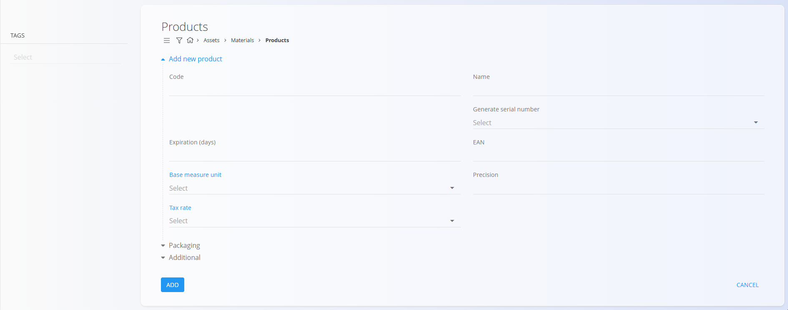

# Izdelki

**Izdelki** so končni proizvodi, ki jih podjetje izdeluje ali kupuje. Te postavke se lahko prodajajo kupcem, skladiščijo v skladišču ali uporabljajo v internih procesih. Primeri izdelkov so hrastova miza, pisarniški stol, LED svetilka ali vrtna klop.

Vsak izdelek vsebuje pomembne podatke – kot so [merske enote](../../Skupno/Šifranti/MerskeEnote.md), [davčna stopnja](../../Skupno/Šifranti/DavčneStopnje.md), rok uporabe ali [pakiranje](Pakiranje.md) – ki zagotavljajo dosledno upravljanje v zalogi, prodaji in proizvodnih dokumentih. Ta šifrant predstavlja vse končne izdelke, ki so na voljo v vašem katalogu.

> [!TIP]
> Za celoten prikaz si oglejte video vodič  
> **[Materiali izdelkov](https://www.youtube.com/watch?v=FcrJ_IHQYeA)**.

> [!NOTE]  
> **Predpogoji**  
> Pred upravljanjem izdelkov preverite, ali so pravilno nastavljeni naslednji šifranti:  
> - [**Merske enote**](../../Skupno/Šifranti/MerskeEnote.md)  
> - [**Davčne stopnje**](../../Skupno/Šifranti/DavčneStopnje.md)

Za dostop do šifranta **Izdelki** pojdite na  
**Sredstva / Materiali / Izdelki** v [navigaciji](../../Skupno/UI/Navigacija.md).

## Shema

| Polje | Opis |
|------|------|
| **Koda** | Enolični identifikator izdelka znotraj seznama materialov. Na primer **2625001** ali **MIZ-ČLS**. Koda mora biti enolična med vsemi materiali. |
| **Ime** | Ime izdelka, prikazano v seznamih in dokumentih. Na primer **Miza – hrast**. |
| **Generiranje serijske številke** | Določa način upravljanja serijskih številk in zapisov materialov: • **Samodejno** – vsak kos prejme svojo naraščajočo serijsko številko. • **Enako** – vsi kosi imajo enako serijsko številko, vendar ostanejo ločeni zapisi. • **Identično** – vsi kosi imajo enako serijsko številko in se obravnavajo kot en identičen zapis. |
| **Rok uporabe (dni)** | Število dni do poteka, uporabljeno za pokvarljivo blago. Na primer **30** ali **365**. |
| **EAN** | Vrednost črtne kode, uporabljena za skeniranje. Na primer **3831234567890**. |
| **Osnovna merska enota** | Merska enota za izražanje količin, kot sta **kos** ali **meter**. |
| **Davčna stopnja** | Privzeta davčna stopnja, uporabljena v poslovnih dokumentih. Na primer **22** ali **9,5**. |
| **Natančnost** | Privzeto število decimalnih mest za prikaz vrednosti. Na primer **3** za **1,255** ali **1** za **2,5**. |
| **Opis** | Kratek interni opis, ki pojasnjuje uporabo ali specifikacije izdelka. Na primer **Masiven hrast, oljen**. |
| **Oznake** | Oznake za kategorizacijo in filtriranje. Na primer **pohištvo**, **premium**. |
| **URL informacij** | Povezava do zunanjih informacij ali dokumentacije o izdelku. |
| **URL slike** | Javna povezava do slike izdelka. |
| **Zunanji ključ** | Identifikator zapisa v zunanjem sistemu, na primer **SAP-4711**. |
| **Aktiven** | Določa, ali je izdelek na voljo za uporabo v novih dokumentih. Neaktivni izdelki niso več na voljo za nove vnose, ostanejo pa vidni v zgodovini. |

## Upravljanje

### Seznam izdelkov

Uporabniški vmesnik vsebuje seznam izdelkov. Če zapisi še ne obstajajo, je seznam prazen.

Seznam prikazuje ime izdelka, kodo in način generiranja serijske številke.

Na levi strani zaslona je na voljo filter po **Oznakah**, v zgornjem desnem kotu pa **iskalno polje** za hitro iskanje določenih izdelkov.

## Dejanja

Kliknite [**akcijski gumb**](../../Skupno/UI/AkcijskiGumb.md), da se prikažejo naslednja dejanja:

- **Uvoz**
- **Kopiraj obstoječe**
- **Novo**

### Uvoz

Dejanje **Uvoz** omogoča hkratni uvoz več materialov izdelkov z uporabo ustrezno pripravljene preglednice.

Za podrobnosti glejte dokumentacijo  
[**Uvoz materialov**](UvozMaterialov.md).

### Kopiraj obstoječe

Kliknite **Kopiraj obstoječi izdelek**, da ustvarite nov izdelek na podlagi že obstoječega. Prikaže se izbirni seznam razpoložljivih osnovnih izdelkov.

Po izbiri osnovnega izdelka so vsa polja predizpolnjena in jih je mogoče urediti pred shranjevanjem.

### Novo

Kliknite **Novo**, da odprete obrazec za dodajanje novega izdelka. Obrazec vključuje polja, kot so **Koda**, **Ime**, **Generiranje serijske številke**, **Osnovna merska enota**, **Davčna stopnja** in druga, odvisno od konfiguracije sistema.

Na voljo so dodatni zložljivi razdelki:

#### Pakiranje

Ta razdelek omogoča pregled ali dodajanje enega ali več zapisov [pakiranja](Pakiranje.md), specifičnih za material. Vsak zapis predstavlja eno pakirno enoto z lastno količino in identifikacijo.

Zapisi pakiranja se kasneje uporabljajo v skladiščnih procesih, kot so:
- [Prevzemi](../../Logistika/Dokumenti/Prevzemi.md)
- [Izdaje](../../Logistika/Dokumenti/Izdaje.md)
- [Medskladiščni prenosi](../../Logistika/Dokumenti/MedskladiščniPrenosi.md)

#### Dodatno

Ta razdelek vsebuje neobvezna opisna polja, kot so opis materiala, oznake, slike, povezave ali zunanji identifikatorji. Ta polja zagotavljajo dodatni kontekst, vendar ne vplivajo na izračune zaloge.

Po vnosu zahtevanih podatkov kliknite **Dodaj**, da shranite izdelek, ali **Prekliči**, da se vrnete na seznam.

## Urejanje

Za urejanje obstoječega izdelka kliknite **Ime** izdelka v seznamu. Vmesnik se preklopi v način urejanja, kjer so prikazana vsa polja. Kliknite **Shrani** za potrditev sprememb ali **Prekliči** za zavrnitev.

## Brisanje

Kliknite **Izbriši** na zaslonu za urejanje, da odprete potrditveno pogovorno okno:

**Ali ste prepričani, da želite izbrisati ta zapis?**

Če potrdite, se izdelek trajno odstrani; v nasprotnem primeru sistem ohrani zapis nespremenjen.

> [!NOTE]
> Izdelek je mogoče izbrisati le, če ni referenciran v odvisnih zapisih, kot so premiki zaloge, dokumenti ali strukture materialov.

---
