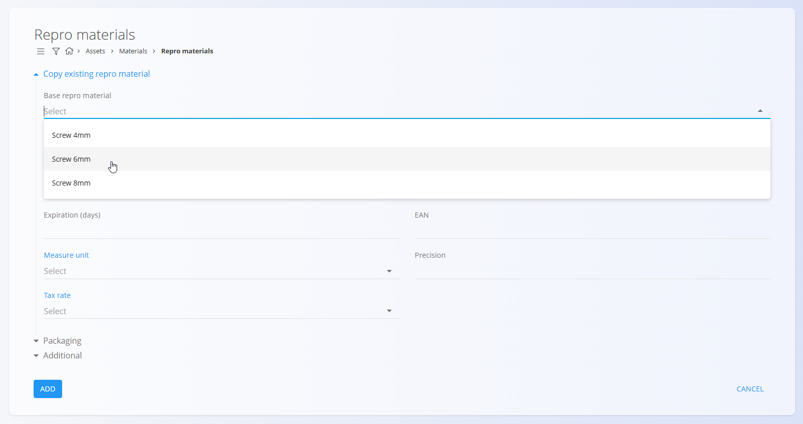
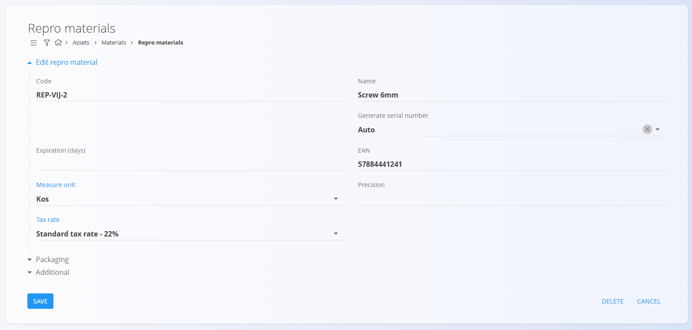

# Repro materiali

**Repro materiali** so ponovno uporabni ali pomožni materiali, ki se uporabljajo za podporo proizvodnji ali drugim internim dejavnostim. Ne predstavljajo končnih izdelkov, so pa ključni za vzdrževanje, montažo ali uporabo drugih materialov. Primeri repro materialov so vijaki, trakovi, palete ali stiropor.

Vsak repro material vsebuje pomembne lastnosti – kot so [merske enote](../../Skupno/Sifranti/MerskeEnote.md), [davčna stopnja](../../Skupno/Sifranti/DavcneStopnje.md), način generiranja serijskih številk ali možnosti [pakiranja](Pakiranje.md) – kar zagotavlja dosledno sledenje in uporabo v vseh skladiščnih in proizvodnih procesih. Ta šifrant vsebuje vse repro materiale, ki jih uporablja organizacija.

> [!TIP]
> Za celovit prikaz si oglejte video vodič  
> **[Repro materiali](https://www.youtube.com/watch?v=ZRUwbQrAolU)**.

> [!NOTE]  
> **Predpogoji**  
> Pred upravljanjem repro materialov zagotovite, da so naslednji šifranti pravilno nastavljeni:  
> - [**Merske enote**](../../Skupno/Sifranti/MerskeEnote.md)  
> - [**Davčne stopnje**](../../Skupno/Sifranti/DavcneStopnje.md)

Za dostop do šifranta **Repro materiali** pojdite na  
**Sredstva / Materiali / Repro materiali** v [navigaciji](../../Skupno/UI/Navigacija.md).

## Shema

| Polje | Opis |
|------|------|
| **Koda** | Enolični identifikator repro materiala znotraj seznama materialov. Na primer **REP-VIJ-2**. Koda mora biti enolična med vsemi materiali. |
| **Ime** | Ime, prikazano v seznamih in dokumentih. Na primer **Vijak 6 mm**. |
| **Generiranje serijske številke** | Določa način obravnave serijskih številk in zapisov materiala: • **Samodejno** – vsak kos prejme svojo naraščajočo serijsko številko. • **Enako** – vsi kosi imajo enako serijsko številko, vendar ostanejo ločeni zapisi. • **Identično** – vsi kosi imajo enako serijsko številko in se obravnavajo kot en identičen zapis. |
| **Rok uporabe (dni)** | Število dni do poteka materiala, uporabljeno za pokvarljive materiale. Na primer **30** ali **365**. |
| **EAN** | Vrednost črtne kode, uporabljena za skeniranje. Na primer **57884441241**. |
| **Osnovna merska enota** | Merska enota za izražanje količin, kot sta **kos** ali **meter**. |
| **Davčna stopnja** | Privzeta davčna stopnja, uporabljena v poslovnih dokumentih. Na primer **22** ali **9,5**. |
| **Natančnost** | Privzeto število decimalnih mest za prikaz vrednosti. Na primer **3** za **1,255** ali **1** za **2,5**. |
| **Opis** | Kratek interni opis, ki določa namen ali lastnosti materiala. |
| **Oznake** | Oznake za kategorizacijo in filtriranje. |
| **URL informacij** | URL povezava do zunanjih informacij ali dokumentacije o materialu. |
| **URL slike** | Javna povezava do slike materiala. |
| **Zunanji ključ** | Identifikator zapisa v zunanjem sistemu za povezovanje med sistemi. |
| **Aktiven** | Označuje, ali je material na voljo za uporabo v novih dokumentih. Neaktivni materiali niso več na voljo za nove vnose, ostanejo pa vidni v zgodovini. |

## Upravljanje

### Seznam repro materialov

Uporabniški vmesnik vsebuje seznam repro materialov.

Seznam prikazuje ime, kodo in način generiranja serijske številke za vsak repro material.

Na levi strani zaslona je na voljo filter po **Oznakah**, v zgornjem desnem kotu pa **iskalno polje** za hitro iskanje določenih materialov.

## Dejanja

Kliknite [**akcijski gumb**](../../Skupno/UI/AkcijskiGumb.md), da se prikažejo naslednja dejanja:

- **Uvoz**
- **Kopiraj obstoječe**
- **Novo**

### Uvoz

Dejanje **Uvoz** omogoča hkratni uvoz več repro materialov z uporabo pravilno strukturirane preglednice.

Za podrobnosti glejte dokumentacijo  
[**Uvoz materialov**](UvozMaterialov.md).

### Kopiraj obstoječe

Kliknite **Kopiraj obstoječi repro material**, da ustvarite nov zapis na podlagi že obstoječega.

Po izbiri osnovnega materiala so vsa polja predizpolnjena in jih je mogoče urediti pred shranjevanjem.

### Novo

Kliknite **Novo**, da odprete obrazec za ustvarjanje novega repro materiala.

Obrazec vključuje polja, kot so **Koda**, **Ime**, **Generiranje serijske številke**, **Osnovna merska enota**, **Davčna stopnja** in druga, odvisno od konfiguracije sistema.

Na voljo so dodatni zložljivi razdelki:

#### Pakiranje

Ta razdelek omogoča pregled ali dodajanje enega ali več zapisov [pakiranja](Pakiranje.md), specifičnih za material. Vsak zapis predstavlja eno pakirno enoto z lastno količino in identifikacijo.

Zapisi pakiranja se kasneje uporabljajo v skladiščnih procesih, kot so:
- [**Prevzemi**](../../Logistika/Dokumenti/Prevzemi.md)
- [**Izdajnice**](../../Logistika/Dokumenti/Izdajnice.md)
- [**Medskladiščni promet**](../../Logistika/Dokumenti/MedskladiscniPromet.md)

#### Dodatno

Ta razdelek vsebuje neobvezna opisna polja, kot so opis materiala, oznake, slike, povezave ali zunanji identifikatorji. Ta polja zagotavljajo dodaten kontekst, vendar ne vplivajo na izračune zaloge.

Po vnosu zahtevanih podatkov kliknite **Dodaj**, da shranite repro material, ali **Prekliči**, da se vrnete na seznam.

## Urejanje

Za urejanje obstoječega repro materiala kliknite njegovo **Ime** v seznamu. Vmesnik se preklopi v način urejanja.

Kliknite **Shrani** za potrditev sprememb ali **Prekliči** za zavrnitev.

## Brisanje

Kliknite **Izbriši** na zaslonu za urejanje, da odprete potrditveno pogovorno okno:

**Ali ste prepričani, da želite izbrisati ta zapis?**

Če potrdite, se repro material trajno odstrani; v nasprotnem primeru sistem ohrani zapis nespremenjen.

> [!NOTE]
> Repro material je mogoče izbrisati le, če ni referenciran v odvisnih zapisih (npr. premiki zaloge, proizvodni procesi ali dokumenti).

---
