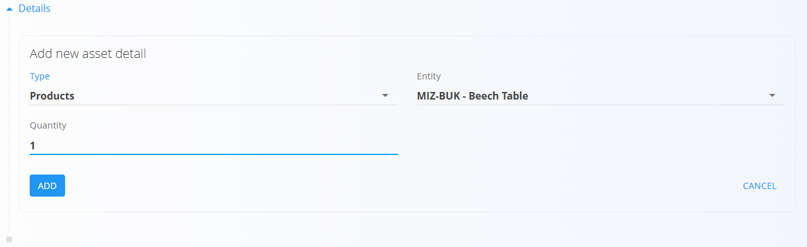
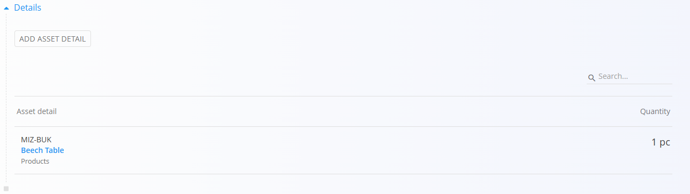

# Sredstva

**Sredstvo** predstavlja izdelek ali storitev, ki se lahko *proda* ali *zaračuna* v sistemu. Za razliko od **materialov** — ki se uporabljajo za sledenje zalogam, logistiko ali proizvodnjo — so **sredstva komercialne postavke**, namenjene cenitvi, ponujanju in obračunu.

Sredstva lahko predstavljajo:

- **Blago** (npr. končni izdelek, ponujen kupcem)
- **Storitve** (npr. montaža, prevoz, svetovanje)

Sredstva **ne sodelujejo v premikih zalog**. Namesto tega določajo prodajne postavke z lastno ceno, davčno stopnjo in lastnostmi. Sredstvo lahko po želji referencira materiale, kadar je prodani izdelek hkrati tudi predmet zalogovnega spremljanja.

Za dostop do tega zaslona pojdite na **Sredstva / Sredstva** v [**navigaciji**](../../Skupno/UI/Navigacija.md).

## Shema

| Polje | Opis |
|------|------|
| **Šifra** | Enolični identifikator sredstva (obvezno). |
| **Ime** | Prikazno ime sredstva (obvezno). |
| **Tip** | Določa, ali je sredstvo **Blago** ali **Storitev** (obvezno). |
| [**Davek**](../../Skupno/Upravljanje/DavcneStopnje.md) | Uporabljena davčna stopnja (neobvezno). |
| [**Merska enota**](../../Skupno/Upravljanje/MerskeEnote.md) | Enota za prikaz in cenitev sredstva (obvezno). |
| **Neto cena (na enoto)** | Neto cena na enoto sredstva. |
| **Neto teža (kg)** | Teža sredstva, če je relevantna (privzeto = 0). |
| **EAN** | Črtna koda (neobvezno). |
| **Oznake** | Neobvezne oznake za razvrščanje. |
| **Opis** | Dodatno besedilo z razlago sredstva. |
| **Podrobnosti** | Seznam komponent sredstva (npr. povezani materiali ali količine). |

## Dejanja

### Dodajanje novega sredstva

Kliknite **[akcijski gumb](../../Skupno/UI/AkcijskiGumb.md)** in izberite **Nov** za ustvarjanje novega sredstva. Pred shranjevanjem morate vnesti naslednja polja:

- **Šifra**
- **Ime**
- **Tip**
- **Merska enota**

Neobvezna polja, kot so **Davek**, **Neto cena (na enoto)**, **EAN**, **Oznake** in **Dodatni podatki**, lahko izpolnite po potrebi.

### Razdelek Podrobnosti

Po shranjevanju sredstva lahko dodate **podrobnosti sredstva**.  
Te omogočajo povezavo sredstva z drugimi entitetami, kot so materiali (na primer, kadar prodani izdelek ustreza zalogovno spremljanemu materialu).

Vsaka podrobnost vključuje:

- **Tip** (npr. Izdelki)
- **Entiteta** (izbran material ali postavka)
- **Količina**

  

### Uvoz

Dejanje **Uvoz** odpre obrazec *Uvoz po materialu*, ki omogoča hitro ustvarjanje sredstev na podlagi obstoječih materialov.

Uporabniki lahko izberejo:

- **Tip**
- **Kodo materiala**
- **Neto ceno postavke**
- **Količino**

Kliknite **Uvoz**, da ustvarite zapise sredstev, ali **Prekliči**, da zaprete obrazec brez sprememb.

## Filtri

Seznam sredstev lahko filtrirate z uporabo:

- **Pogled**: Omogočeno / Onemogočeno
- **Tip**: Blago / Storitev
- **Oznake**

Ti filtri pomagajo pri iskanju določenih sredstev in poenostavijo upravljanje obsežnih katalogov.

## Brisanje

Kliknite **Izbriši** na zaslonu za urejanje, da odstranite izbrano sredstvo.

Prikaže se potrditveno pogovorno okno:

**Ali ste prepričani, da želite izbrisati ta zapis?**

Če potrdite, se sredstvo trajno odstrani.  
Če je sredstvo referencirano v drugih dokumentih ali zapisih, je lahko brisanje onemogočeno, dokler se odvisnosti ne razrešijo.

---
