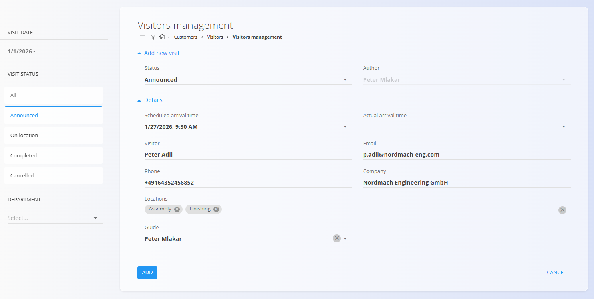
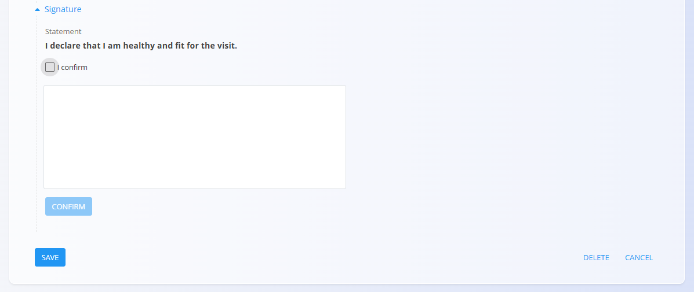

# Urejanje obiskov

Zaslon **Urejanje obiskov** je namenjen ustvarjanju in spremljanju evidenc obiskov. Omogoča beleženje podatkov o obiskovalcih, načrtovanem in dejanskem času prihoda, statusu obiska ter prostorih in oddelkih, ki jih obiskovalec obišče.

Vsak obisk ima jasno določen življenjski cikel – od najave do zaključka ali odpovedi.

Za dostop do **Urejanja obiskov** pojdite na **Stranke / Obiskovalci / Urejanje obiskov** v [navigaciji](../../Skupno/UI/Navigacija.md).

## Shema

| Polje | Opis |
|------|------|
| **Status** | Trenutni status obiska: *Najavljen*, *Na lokaciji*, *Zaključen* ali *Odpovedan* |
| **Avtor** | Uporabnik, ki je ustvaril zapis obiska |
| **Načrtovan čas prihoda** | Predviden datum in čas prihoda obiskovalca |
| **Dejanski čas prihoda** | Dejanski datum in čas prihoda obiskovalca |
| **Obiskovalec** | Ime in priimek obiskovalca (obvezno) |
| **E-pošta** | E-poštni naslov obiskovalca |
| **Telefon** | Telefonska številka obiskovalca |
| **Podjetje** | Podjetje, ki ga obiskovalec predstavlja |
| **Lokacije** | Lokacije obiska, prevzete iz šifranta [**Organizacijske enote**](../../Proizvodnja/Upravljanje/OrganizacijskeEnote.md). |
| **Spremljevalec** | Interna oseba, odgovorna za obiskovalca |
| **Podpis** | Potrditev in podpis obiskovalca, na voljo v načinu urejanja |

## Seznam in filtri

Seznamski pogled prikazuje vse zabeležene obiske in omogoča hitro filtriranje za lažje iskanje relevantnih vnosov.

V seznamu so obiski vizualno ločeni po barvah:

- Najavljen – siva  
- Na lokaciji – zelena  
- Zaključen – modra  
- Odpovedan – rdeča  

Razpoložljivi filtri:

- **Čas obiska**  
- **Status obiska**
  - Vsi
  - Najavljen
  - Na lokaciji
  - Zaključen
  - Odpovedan
- **Oddelek**

Vsaka vrstica prikazuje obiskovalca, podjetje, obiskane lokacije ter datum/čas obiska.

## Življenjski cikel in statusi obiska

Obisk prehaja skozi naslednje statuse:

- **Najavljen** – obisk je vnaprej načrtovan in zabeležen.
- **Na lokaciji** – obiskovalec je prispel na lokacijo.
- **Zaključen** – obisk je končan.
- **Odpovedan** – obisk je bil odpovedan in se ni izvedel.

## Ustvarjanje novega obiska

Nov obisk se ustvari, ko je načrtovan fizični obisk.

Tipičen potek:

1. Kliknite [**akcijski gumb**](../../Skupno/UI/AkcijskiGumb.md) za ustvarjanje novega obiska.
2. **Status** je privzeto nastavljen na **Najavljen**.
3. Izpolnite podrobnosti obiska (polje **Obiskovalec** je obvezno).
4. Kliknite **Shrani**.

Obisk se prikaže v seznamu kot *Najavljen*.

## Upravljanje obiska

### Prihod obiskovalca

Ko obiskovalec prispe na lokacijo:

1. Odprite zapis obiska.
2. Spremenite **Status** v **Na lokaciji**.
3. Zabeležite **Dejanski čas prihoda**.
4. Obiskovalec lahko potrdi izjavo v razdelku **Podpis** (glejte spodaj).
5. Kliknite **Shrani**.

Obisk se prikaže v seznamu kot *Na lokaciji*. Začne se beleženje trajanja obiska.

#### Potrditev podpisa

Pri odpiranju zapisa v načinu urejanja se prikaže razdelek **Podpis**.

Obiskovalec lahko izjavo potrdi in se podpiše neposredno v obrazcu.

### Zaključek obiska

Po koncu obiska:

1. Odprite zapis obiska.
2. Spremenite **Status** v **Zaključen**.
3. Kliknite **Shrani**.

S tem se konča beleženje trajanja obiska.  
Obisk se premakne med **Zaključene** in prikaže tako čas prihoda kot čas odhoda.

### Odpoved obiska

Če se načrtovan obisk ne izvede:

1. Odprite zapis obiska.
2. Nastavite **Status** na **Odpovedan**.
3. Kliknite **Shrani**.

Obisk se prikaže v stanju **Odpovedan** in je ustrezno označen v seznamu.

## Brisanje obiska

Obiske je mogoče izbrisati, če so bili ustvarjeni pomotoma ali niso več potrebni.

Postopek:
1. Odprite zapis obiska.
2. Kliknite **Izbriši** in potrdite dejanje.

---
