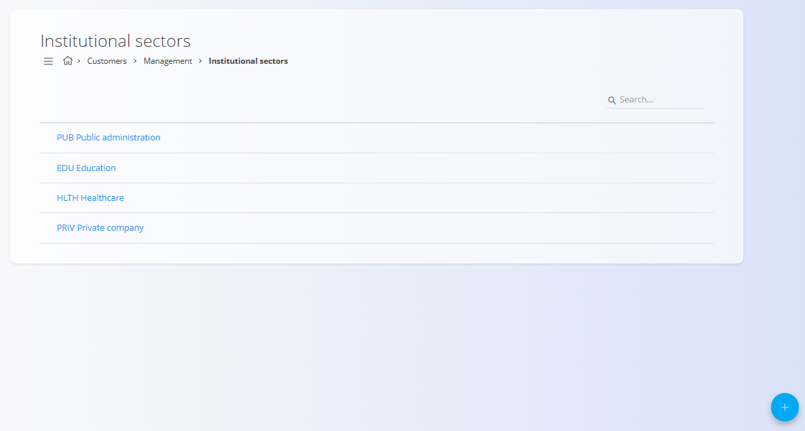

# Institucionalni sektorji

## Uvod

**Institucionalni sektorji** so **šifrant**, ki se uporablja za razvrščanje strank glede na njihovo organizacijsko ali institucionalno naravo (na primer javna uprava, izobraževanje, zdravstvo ali zasebna podjetja).

Ti sektorji se kasneje uporabljajo pri definiranju in upravljanju podatkov o strankah ter omogočajo boljšo segmentacijo, poročanje in filtriranje v šifrantu [**Poslovni imenik**](../../Skupno/Upravljanje/PoslovniImenik.md).

Za dostop do tega zaslona pojdite na **Stranke / Upravljanje / Institucionalni sektorji** v [navigaciji](../../Skupno/UI/Navigacija.md).

## Shema

| Polje | Opis |
|------|------|
| **[Šifra](../../Skupno/UI/SifreDokumentov.md)** | Kratka, enolična oznaka institucionalnega sektorja. |
| **Naziv** | Opisni naziv institucionalnega sektorja. |

## Seznam institucionalnih sektorjev

Seznam prikazuje vse definirane institucionalne sektorje v sistemu.

Značilnosti seznama:
- prikaz **Šifre** in **Naziva** sektorja,
- možnost **iskanja** za hitro filtriranje,
- klik na vrstico odpre sektor v načinu urejanja.

## Dejanja

Naslednja dejanja so na voljo prek [**akcijskega gumba**](../../Skupno/UI/AkcijskiGumb.md):

- **Nov** – ustvari nov institucionalni sektor.
- **Uvoz** – množični uvoz institucionalnih sektorjev iz CSV datoteke.

### Ustvari nov institucionalni sektor

1. Kliknite [**akcijski gumb**](../../Skupno/UI/AkcijskiGumb.md) in izberite **Nov**.
2. Vnesite:
   - **Šifra** – kratka oznaka (npr. `JAV`)
   - **Naziv** – polni naziv sektorja (npr. *Javna uprava*)
3. Kliknite **DODAJ** za shranjevanje.

### Urejanje institucionalnega sektorja

- Kliknite obstoječi sektor v seznamu.
- Po potrebi posodobite **Šifro** ali **Naziv**.
- Shranite spremembe.

### Brisanje institucionalnega sektorja

- Odprite sektor iz seznama.
- V pogledu za urejanje uporabite dejanje **Izbriši**.
- Potrdite brisanje.

> [!NOTE]
> Izbrisani institucionalni sektorji niso več na voljo za izbiro pri dodeljevanju sektorjev strankam.

---