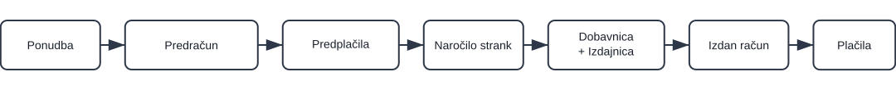

<!-- canonical_source_url: https://github.com/Tom-PIT/Connected.Docs/blob/main/sl/Uvod/02.ProdajniProcesSPredplacilom.md -->
<!-- canonical_source_title: Prodajni proces (s predplačilom) -->

# Prodajni proces (z avansnim računom)

Ta vodič prikazuje tipičen prodajni proces, ki vključuje korak avansnega računa. Za podrobnosti uporabite povezave; nastavitev ne podvajajte na tej strani.

> [!TIP]
> Sledite temu vodiču korak za korakom za konfiguracijo platforme. Po potrebi uporabite povezave za odpiranje posameznega šifranta ali nastavitve, nato pa se vrnite na to stran in nadaljujte z naslednjim korakom.

## Pregled

Potek: **Ponudba → Predračun → Avansni račun → Naročilo stranke → Dobavnica/Izdajnica → Izdani račun → Plačila**

> [!NOTE]
> Premik zaloge se izvede pri **Izdajnici**. **Avansni račun** in **Izdani račun** beležita finančne transakcije.

## Koraki

<!-- app_route: /sales/documents/offers -->
<!-- app_label: Ponudbe -->

### 1. Ustvarite in objavite prodajno ponudbo

Ustvarite komercialno ponudbo za potrditev cen, količin in veljavnosti s stranko.

1. Pojdite na **Prodaja / Dokumenti / Ponudbe**
2. Uporabite [**akcijski gumb**](../Skupno/UI/AkcijskiGumb.md) za ustvarjanje osnutka [ponudbe](../Domene/Prodaja/Dokumenti/Ponudbe.md)
3. Izpolnite stranko, veljavnost in dodajte postavke v razdelku **Podrobnosti**
4. Kliknite **Objavi** za potrditev komercialnih pogojev

<!-- app_route: /sales/documents/proforma-invoices -->
<!-- app_label: Predračuni -->

### 2. Ustvarite predračun

Dogovorjeno ponudbo pretvorite v predračun za zahtevo avansnega računa in posredovanje plačilnih podatkov.

1. Iz potrjene ponudbe izberite **Povezani dokumenti → [**+ Predračun**](../Domene/Prodaja/Dokumenti/Predracuni.md)**
2. Prilagodite sklice, bančni račun in veljavnost
3. Prilagodite količine izdelkov glede na dogovorjeni znesek avansnega računa. Kliknite vrstico izdelka, odprite urejanje in nastavite količino, ki bo avansirana; seštevki se samodejno posodobijo.
4. Kliknite **Objavi**

<!-- app_route: /sales/documents/prepayments -->
<!-- app_label: Predplačila -->

### 3. Zabeležite avansni račun (delno ali v celoti)

Zabeležite prejeti avansni račun stranke, da je naročilo finančno pokrito pred dobavo.

1. Iz potrjenega predračuna izberite **Povezani dokumenti → [+ Avansni račun](../Domene/Prodaja/Dokumenti/AvansniRacuni.md)**
2. Izpolnite:
   1. datum zapadlosti
   2. vrsto/številko sklica
   3. bančni račun organizacije
   4. način plačila
3. Preverite, da se postavke in zneski avansnega računa ujemajo s količinami iz predračuna, nastavljenimi v 2. koraku.
4. Kliknite **Objavi** za potrditev prejetega avansnega računa

<!-- app_route: /sales/documents/sales-orders -->
<!-- app_label: Naročila strank -->

### 4. Ustvarite naročilo stranke

Ustvarite naročilo stranke za rezervacijo zaloge in planiranje izvedbe.

1. Vrnite se na predhodno potrjeno ponudbo in izberite **Povezani dokumenti → [+ Naročilo stranke](../Domene/Prodaja/Dokumenti/NarocilaStrankUstvarjanje.md)**
2. Potrdite količine in podrobnosti dobave ter kliknite **Objavi**

<!-- app_route: /production-orders -->
<!-- app_label: Proizvodni nalogi -->

### 4a. Obnovite zalogo ali proizvedite (po potrebi)

Če izdelki niso na voljo, glejte **[Obnova zaloge ali proizvodnja](05.ObnovaAliProizvodnja.md)** za možnosti nabave ali proizvodnje pred dobavo.

Za proizvodna podjetja je hiter način ustvarjanja proizvodnega naloga neposredno iz objavljenega naročila stranke:
- **Povezani dokumenti → [**+ Proizvodni nalog**](../Domene/Proizvodnja/Dokumenti/ProizvodniNalogiUstvarjanje.md)**

S tem se ustvari osnutek proizvodnega naloga, ki ga lahko kasneje potrdite v **[domeni Proizvodnja](../Domene/Proizvodnja/Domena/Proizvodnja.md)**.

<!-- app_route: /sales/documents/delivery-notes -->
<!-- app_label: Dobavnice -->

### 5. Dobavite blago

Naročilo stranke je pripravljeno; pripravite pošiljko in izvedite izhod zaloge iz skladišča.

Sledite tem operativnim korakom za izhod zaloge iz skladišča:

1. Iz naročila stranke odprite **Povezani dokumenti → [+ Dobavnica](../Domene/Prodaja/Dokumenti/Dobavnice.md)**.  
   Preverite stranko, naslov dobave in dodajte postavke za odpremo. Količine lahko prilagodite, če se dostavlja le del naročila.
2. V dobavnici odprite **Povezani dokumenti → [+ Polna izdaja](../Domene/Logistika/Dokumenti/Izdajnice.md)**.  
   Izberite skladišče in lokacije ter potrdite količine za komisioniranje.
3. Kliknite **Objavi** za potrditev izdaje.  
   S tem se zaloga izpiše iz skladišča in stanje zaloge se posodobi.
4. (Neobvezno) Preverite spremembo v **[Pogledu zaloge po lokacijah](../Domene/Logistika/Pregledi/PogledZalogePoLokacijah.md)**.

<!-- app_route: /sales/documents/issued-invoices -->
<!-- app_label: Izdani računi -->

### 6. Izdajte končni račun in uporabite avansni račun

Izdajte končni račun za dobavljeno blago, uporabite avansni račun in poravnajte morebitno razliko.

1. Iz dobavnice ali naročila stranke odprite **Povezani dokumenti → [+ Izdani račun](../Domene/Prodaja/Dokumenti/IzdaniRacuniUstvarjanje.md)**
2. Uporabite predhodno zabeležen avansni račun preko **Povezani dokumenti → [Avansni račun](../Domene/Prodaja/Dokumenti/AvansniRacuni.md)** za zmanjšanje zneska za plačilo
3. Preglejte končne zneske in po potrebi dodajte **načine plačila**
4. Kliknite **Objavi** in po potrebi zabeležite preostala plačila z gumbom **Plačilo**

> [!TIP]
> - Uporabite **Povezane dokumente** za prehod med posameznimi fazami in preverjanje samodejno izpolnjenih podatkov (stranka, postavke).
> - Odprite **[Poslovne kartice](../Domene/Prodaja/Pregledi/PoslovneKartice.md)** za pregled zgodovine stranke, naročil in stanj.
