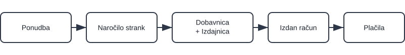

# Prodajni proces (brez predplačila)

Ta vodič prikazuje tipičen prodajni proces brez uporabe predplačil. Za podrobnosti uporabite povezave; nastavitev ne podvajajte na tej strani.

> [!TIP]
> Sledite temu vodiču korak za korakom za konfiguracijo platforme. Po potrebi uporabite povezave za odpiranje posameznega šifranta ali nastavitve, nato pa se vrnite na to stran in nadaljujte z naslednjim korakom.

## Pregled

Potek: Ponudba → Naročilo stranke → Dobavnica/Izdajnica → Izdani račun → Plačila

> [!NOTE]
> - V nekaterih primerih se proces začne neposredno z **Naročilom stranke**. Korak **Ponudba** je neobvezen.
> - Premik zaloge se izvede pri **Izdajnici**.
> - **Izdani račun** beleži prihodke in plačila.

## Koraki

### 1. Ustvarite in objavite prodajno ponudbo (neobvezno)

Ustvarite komercialno ponudbo za potrditev cen, količin in veljavnosti s stranko.

1. Pojdite na **Prodaja / Dokumenti / Ponudbe**
2. Uporabite **[akcijski gumb](../Skupno/UI/AkcijskiGumb.md)** za ustvarjanje osnutka [prodajne ponudbe](../Domene/Prodaja/Dokumenti/Ponudbe.md)
3. Izpolnite stranko, veljavnost in dodajte postavke
4. Kliknite **Objavi** za potrditev komercialnih pogojev

### 2. Ustvarite naročilo stranke

Ustvarite naročilo stranke za rezervacijo zaloge in planiranje izvedbe.

1. Iz potrjene ponudbe izberite **Povezani dokumenti → [+ Naročilo stranke](../Domene/Prodaja/Dokumenti/NarocilaStrank.md)**
2. Potrdite količine in podrobnosti dobave ter kliknite **Objavi**

### 2a. Obnovite zalogo ali proizvedite (po potrebi)

Če izdelki niso na voljo, glejte **[Obnova zaloge ali proizvodnja](05.ObnovaAliProizvodnja.md)** za možnosti nabave ali proizvodnje pred dobavo.

Za proizvodna podjetja je hiter način ustvarjanja proizvodnega naloga neposredno iz objavljenega naročila stranke:
- **Povezani dokumenti → [**+ Proizvodni nalog**](../Domene/Proizvodnja/Dokumenti/ProizvodniNalogi.md)**

S tem se ustvari osnutek proizvodnega naloga, ki ga lahko kasneje potrdite v **[domeni Proizvodnja](../Domene/Proizvodnja/Domena/Proizvodnja.md)**.

### 3. Dobavite blago

Naročilo stranke je pripravljeno; pripravite pošiljko in izvedite izhod zaloge iz skladišča.

1. Iz naročila stranke odprite **Povezani dokumenti → [+ Dobavnica](../Domene/Prodaja/Dokumenti/Dobavnice.md)**.  
   Preverite stranko, naslov dobave in dodajte postavke za odpremo.
2. V dobavnici odprite **Povezani dokumenti → [+ Polna izdaja](../Domene/Logistika/Dokumenti/Izdajnice.md)**.  
   Izberite skladišče in lokacije ter potrdite količine za komisioniranje.
3. Kliknite **Objavi** za potrditev izdaje.  
   S tem se zaloga izpiše iz skladišča in stanje zaloge se posodobi.
4. (Neobvezno) Preverite spremembo v **[Pogledu zaloge po lokacijah](../Domene/Logistika/Pregledi/PogledZalogePoLokacijah.md)**.

### 4. Izdajte končni račun in zabeležite plačila

Izdajte račun za dobavljeno blago in zabeležite prejeta plačila.

1. Iz naročila stranke ali dobavnice odprite **Povezani dokumenti → [+ Izdani račun](../Domene/Prodaja/Dokumenti/IzdaniRacuni.md)**
2. Preglejte končne zneske in po potrebi dodajte **načine plačila**
3. Kliknite **Objavi**
4. Prejeta plačila (delna ali v celoti) zabeležite z gumbom **Plačilo**

> [!TIP]
> - Uporabite **Povezane dokumente** za prehod med posameznimi fazami in preverjanje samodejno izpolnjenih podatkov (stranka, postavke).
> - Odprite **[Poslovne kartice](../Domene/Prodaja/Pregledi/PoslovneKartice.md)** za pregled zgodovine stranke, naročil in stanj.

------
