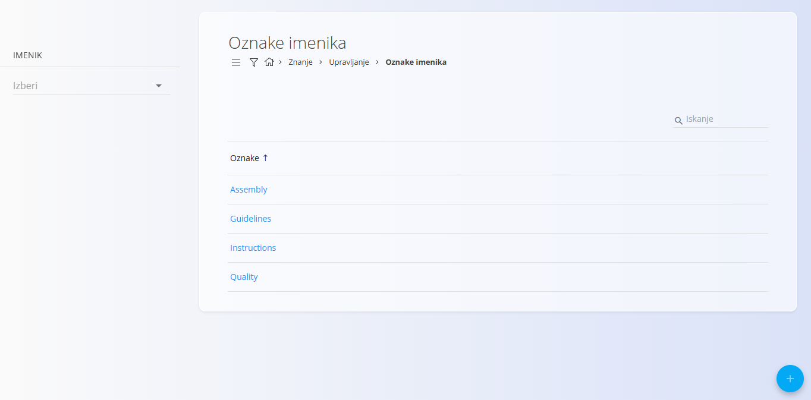
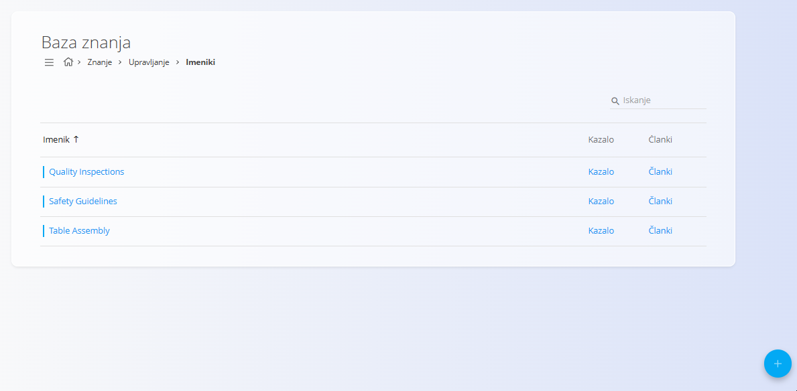
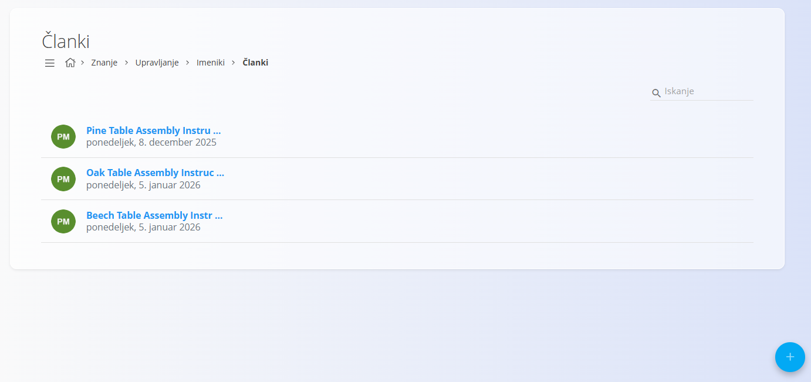
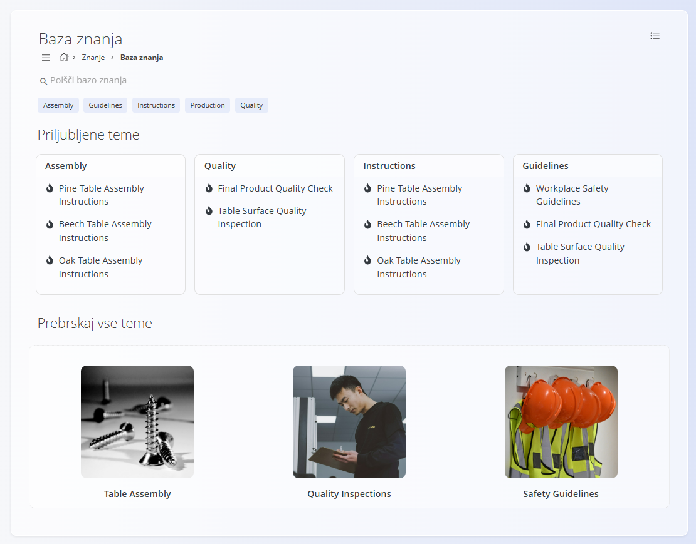

<!-- canonical_source_url: https://github.com/Tom-PIT/Connected.Docs/blob/main/sl/Uvod/UstvarjanjeInVzdrzevanjeBazeZnanja.md -->
<!-- canonical_source_title: Ustvarjanje in vzdrževanje baze znanja -->

# Ustvarjanje in vzdrževanje baze znanja

Ta vodič pojasnjuje, kako ustvariti strukturirano bazo znanja, ki jo lahko uporabniki pregledujejo, iščejo in vzdržujejo skozi čas.

Ustvarili boste:

* Oznake imenikov za kategorizacijo vsebine
* Imenike za organizacijo vsebine
* Članke z dokumentacijo
* Kazalo za navigacijo

Po zaključku bodo uporabniki lahko brskali in iskali dokumentacijo v bazi znanja.

## Cilj

Vzpostaviti bazo znanja, ki:

* Organizira dokumentacijo po logičnih temah
* Omogoča jasno navigacijo prek kazala
* Podpira iskanje in filtriranje z oznakami
* Omogoča dolgoročno vzdrževanje vsebine

## Koraki

### 1. Načrtujte strukturo baze znanja

Pred ustvarjanjem vsebine določite teme, ki jih želite dokumentirati.

Tipični primeri vključujejo:

* Delovna navodila
* Varnostne postopke
* Smernice kakovosti
* Postopke vzdrževanja
* Pogosto zastavljena vprašanja
* Gradiva za uvajanje zaposlenih

Razmislite o:

* Kateri imeniki bodo potrebni
* Kateri članki spadajo v posamezen imenik
* Kako naj uporabniki dostopajo do vsebine

> [!TIP]
> Začnite s preprosto strukturo in jo postopoma nadgrajujte.

### 2. Ustvarite oznake imenikov

**[Oznake imenika](../Domene/Znanje/Upravljanje/OznakeImenika.md)** uporabnikom pomagajo najti vsebino z iskanjem in filtriranjem.

Primeri:

* Montaža
* Kakovost
* Varnost
* Pakiranje
* Vzdrževanje



1. Odprite **Znanje / Upravljanje / Oznake imenikov**.
2. Ustvarite oznake, ki jih potrebujete za svojo dokumentacijo.
3. Shranite oznake.

### 3. Ustvarite imenike

**[Imeniki](../Domene/Znanje/Upravljanje/Imeniki.md)** so osnovni vsebniki za organizacijo vsebine baze znanja.

Primeri:

* Delovna navodila
* Upravljanje kakovosti
* Varnostni postopki
* Vzdrževanje



1. Odprite **Znanje / Upravljanje / Imeniki**.
2. Ustvarite nov imenik.
3. Vnesite naziv, ključ in po želji opis.
4. Shranite imenik.

### 4. Ustvarite članke

**Članki** vsebujejo dejansko dokumentacijo, ki jo bodo uporabniki brali.

Primeri:

* Sestavljanje okvirja mize
* Postopek pakiranja
* Dnevni pregled opreme



1. Odprite **Znanje / Upravljanje / Imeniki**.
2. V želenem imeniku izberite **Članki**.
3. Kliknite [akcijski gumb](../Skupno/UI/AkcijskiGumb.md) za ustvarjanje novega članka.
4. Vnesite:

   * Naslov
   * Ključ
   * Vsebino
   * Po želji:

     * Dodajte priponke.
     * Omogočite komentarje.
     * Določite datum objave ali poteka veljavnosti.
5. Dodelite ustrezne oznake.
6. Shranite članek.

Za podrobnosti glejte **[Članki](../Domene/Znanje/Upravljanje/Clanki.md)**.

### 5. Zgradite kazalo

Kazalo določa, kako uporabniki krmarijo po imeniku.

1. Odprite **Znanje / Upravljanje / Imeniki**.
2. Za želeni imenik izberite **Kazalo**.
3. Ustvarite mape za organizacijo člankov po temah.
4. Dodajte članke v mape.
5. Z ordinalnimi vrednostmi določite vrstni red prikaza.

Za podrobnosti glejte **[Kazalo](../Domene/Znanje/Upravljanje/Kazalo.md)**.

Primer:

```text
Delovna navodila
├── Montaža
│   ├── Sestavljanje okvirja mize
│   └── Namestitev mizne plošče
├── Pakiranje
│   └── Postopek pakiranja
└── Vzdrževanje
    └── Dnevni pregled opreme
```

> [!NOTE]
> Kazalo določa samo navigacijo. Vsebina člankov se upravlja ločeno.

### 6. Preglejte bazo znanja

Ko so imeniki, članki in navigacija pripravljeni:

1. Odprite **Znanje / Baza znanja**.
2. Poiščite svoj imenik.
3. Odprite imenik.
4. Brskajte po člankih prek kazala.
5. Preverite iskanje in filtriranje po oznakah.



Uporabniki lahko:

* Filtrirajo po oznakah
* Brskajo po imenikih
* Odpirajo članke
* Prenesejo priponke
* Dodajajo komentarje (če so omogočeni)

Za podrobnosti glejte **[Baza znanja](../Domene/Znanje/BazaZnanja/BazaZnanja.md)**.

### 7. Vzdrževanje vsebine

Bazo znanja je priporočljivo redno pregledovati.

Priporočene prakse:

* Članki naj bodo kratki in osredotočeni na temo
* Uporabljajte dosledna poimenovanja
* Odstranjujte podvojeno vsebino
* Redno preverjajte zastarele informacije
* Dosledno uporabljajte oznake
* Po potrebi onemogočite neuporabljene imenike
* Po potrebi uporabljajte datume objave in poteka veljavnosti

> [!TIP]
> Za vzdrževanje posameznega imenika določite odgovorno osebo ali skupino.

## Primer: Ustvarjanje knjižnice delovnih navodil

Proizvodno podjetje želi centralizirati dokumentacijo za delo v proizvodnji.

1. Ustvarite oznake:

   * Montaža
   * Pakiranje
   * Vzdrževanje

2. Ustvarite imenik:

   * Delovna navodila

3. Ustvarite članke:

   * Sestavljanje okvirja mize
   * Postopek pakiranja
   * Dnevni pregled opreme

4. Zgradite kazalo:

   * Montaža
   * Pakiranje
   * Vzdrževanje

5. Preglejte imenik v bazi znanja.

Operaterji lahko zdaj iščejo navodila, brskajo po dokumentaciji po temah in dostopajo do najnovejših odobrenih postopkov na enem mestu.
