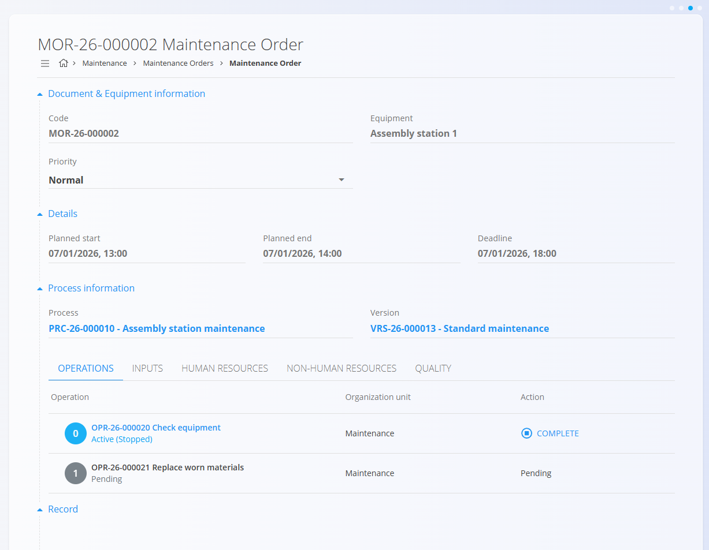
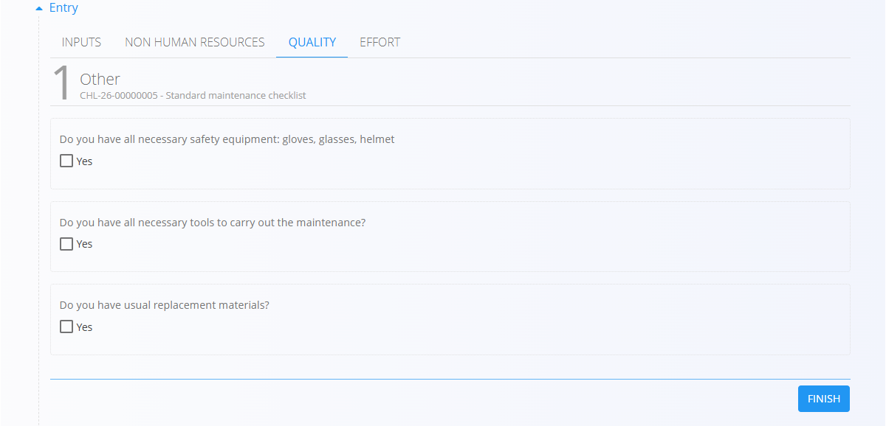

<!-- app_route: /maintenance-orders/list -->
<!-- app_label: Vzdrževalni nalog – hitri uporabniški vodnik -->
<!-- canonical_source_url: https://github.com/Tom-PIT/Connected.Docs/blob/main/sl/Domene/Vzdrzevanje/Dokumenti/VzdrzevalniNalogiHitriVodnik.md -->
<!-- canonical_source_title: Vzdrževalni nalog – hitri uporabniški vodnik -->

# Vzdrževalni nalog – hitri uporabniški vodnik

Ta vodnik prikazuje **osnovne korake** za tehnike in vzdrževalce za
**izvajanje vzdrževalnih del** z uporabo **aktivnega vzdrževalnega naloga**
v sistemu TomPIT.

> [!NOTE]
> To je **hitri operativni vodnik**, namenjen izključno izvajanju vzdrževanja.  
> Ne vključuje ustvarjanja nalogov, planiranja ali urnikov.

## 1. Odprite svoj vzdrževalni nalog

Odprite **aktivni vzdrževalni nalog**, ki vam je dodeljen.

Vzdrževalni nalog prikazuje:
- opremo, na kateri se izvaja vzdrževanje
- vzdrževalne operacije, ki jih je treba izvesti

Vsa vzdrževalna dela se izvajajo v razdelku **Operacije**.

## 2. Odprite operacijo

Kliknite operacijo v seznamu **Operacije**, da odprete **zaslon izvajanja operacije**.

Zaslon vključuje:
- informacije o dokumentu in operaciji
- navodila
- razdelke za izvajanje, kot so:
  - kakovost
  - vhodi
  - nečloveški viri
  - napor

## 3. Izpolnite kontrolne liste (če so zahtevani)

Če so za operacijo definirani kontrolni listi, se samodejno prikažejo ob ustreznem trenutku:
- ob začetku
- med izvajanjem
- ob zaključku

Medtem ko je kontrolni seznam aktiven, drugi razdelki izvajanja
(kot sta Vhodi in Napor) niso na voljo in postanejo dostopni šele po
zaključenem kontrolnem seznamu.

Za nadaljevanje izpolnite kontrolni seznam in kliknite **Zaključi**.

> **Pomembno**  
> Zahtevani kontrolni seznami morajo biti zaključeni pred nadaljevanjem operacije.

## 4. Sledite navodilom

Če so definirana navodila:
- jih preglejte pred začetkom dela
- jih uporabljajte kot vodilo med izvajanjem naloge

Navodila lahko vključujejo varnostna opozorila, zaporedje korakov ali
vizualne reference.

## 5. Zabeležite porabljene materiale (če je potrebno)

Če se med vzdrževanjem uporabljajo materiali:
1. Odprite razdelek **Vhodi**
2. Izberite material
3. Vnesite porabljeno količino
4. Shranite vnos

S tem zagotovite pravilno sledljivost in evidenco porabe materialov.

## 6. Zabeležite delo (delovni čas)

**Delo** predstavlja čas, porabljen za delo na operaciji.

### Samodejno beleženje dela
1. Odprite razdelek **Delo**
2. Kliknite **Začetek**
3. Izvedite vzdrževalno delo
4. Po koncu kliknite **Ustavi**

### Ročni vnos dela
1. Odprite razdelek **Delo**
2. Vnesite zahtevane časovne podatke
3. Shranite vnos

## 7. Zaključite operacijo

Ko je vse zahtevano delo zaključeno:
1. Preverite, da:
   - so kontrolni seznami zaključeni
   - so materiali zabeleženi (če so bili uporabljeni)
   - je napor evidentiran
2. Kliknite **Zaključi** (zgoraj levo na zaslonu operacije)

Po zaključku:
- je operacija označena kot **Zaključena**
- v vzdrževalnem nalogu je prikazana kot zaključena

## 8. Nadaljujte z naslednjo operacijo

Vrnite se na vzdrževalni nalog in ponovite korake za naslednjo operacijo.

Ko so vse operacije zaključene, je vzdrževalno delo zaključeno in
zabeleženo za opremo.

## Povezani vodniki

[**Izvedba – Hitri uporabniški vodnik**](IzvedbaHitriVodnik.md)
