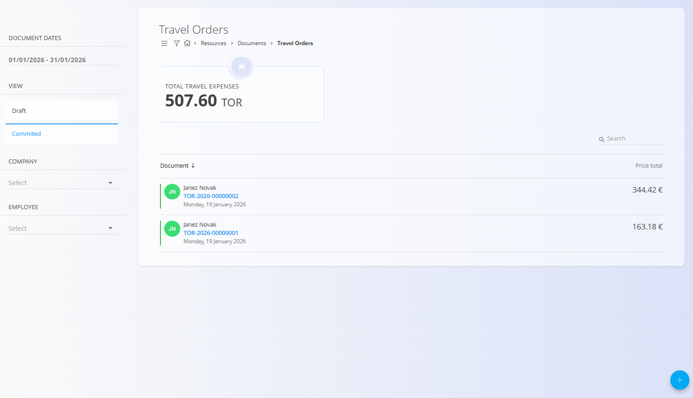

# Potni nalogi

Potni nalogi se uporabljajo za evidentiranje in upravljanje službenih poti zaposlenih. Združujejo kilometrino, dnevnice in druge stroške ter izračunajo skupni strošek poti.

Za dostop do dokumentov **Potni nalogi** pojdite na **Viri / Dokumenti / Potni nalogi** v [**navigaciji**](../../Skupno/UI/Navigacija.md).

## Shema

| Polje | Opis |
|------|------|
| **Dokument** | Oznaka vrste dokumenta. |
| **Šifra** | Samodejno generirana šifra potnega naloga (npr. *TOR-2026-00000004*). |
| **Zaposleni** | Zaposleni, za katerega se potni nalog ustvari. |
| **Datum dokumenta** | Datum potnega naloga (npr. *20. 1. 2026*). |
| **Odhod** | Datum in čas odhoda. |
| **Prihod** | Datum in čas prihoda. |
| **Razlog** | Razlog potovanja iz šifranta [**Razlogi za potovanje**](../Upravljanje/RazlogiZaPotovanje.md). |
| **Prevozno sredstvo** | Prevozno sredstvo, uporabljeno na poti. |
| **Vozilo** | Vozilo kot vir; na voljo so le nečloveški viri, označeni kot vozilo. |
| **Podjetje** | Podjetje, izbrano iz poslovnega imenika. |
| **Lokacija** | Ciljna lokacija potovanja. |
| **Stroškovno mesto** | Stroškovno mesto, dodeljeno potnemu nalogu. |
| **Predujem** | Znesek predujma (npr. *0,00 €*). |
| **Opis** | Dodatni opis ali opombe. |

### Kilometrina

| Polje | Opis |
|------|------|
| **Relacija** | Relacija iz šifranta [**Relacije**](../Upravljanje/Relacije.md). |
| **Datum** | Datum poti (npr. *21. 1. 2026*). |
| **Cena (Na enoto)** | Cena na enoto razdalje (npr. *0,43 €*). |
| **Razdalja** | Prevožena razdalja. |
| **Skupna cena** | Samodejno izračunana skupna cena (npr. *0,00 €*). |
| **Opis** | Neobvezen opis. |
| **Povratna vožnja** | Označuje povratno vožnjo. |

### Dnevnice

| Polje | Opis |
|------|------|
| **Začetni datum** | Začetni datum in čas obdobja (npr. *21. 1. 2026, 12:39*). |
| **Končni datum** | Končni datum in čas obdobja (npr. *21. 1. 2026, 12:39*). |
| **Dnevnica** | Izbrana dnevnica iz šifranta [**Dnevnice**](../Upravljanje/Dnevnice.md). |
| **Znesek znižane** | Znižan znesek dnevnice. |
| **Število** | Število obračunanih dnevnic. |
| **Procent** | Uporabljen odstotek obračuna. |
| **Vrednost** | Izračunana vrednost. |
| **Vključuje zajtrk** | Vključitev zajtrka v obračun. |
| **Vključuje kosilo** | Vključitev kosila v obračun. |
| **Vključuje večerjo** | Vključitev večerje v obračun. |

Vrednosti dnevnic (znižane, polovične, polne) se izračunajo samodejno glede na trajanje in vključene obroke.

### Stroški

| Polje | Opis |
|------|------|
| **Strošek** | Vrsta stroška iz šifranta [**Stroski**](../../Nabava/Upravljanje/Stroski.md). |
| **Datum** | Datum stroška (npr. *21. 1. 2026*). |
| **Cena** | Znesek stroška (npr. *0,00 €*). |
| **Opis** | Neobvezen opis. |

## Seznamski pogled

Seznam prikazuje vse potne naloge ter pregled skupnih stroškov poti.

### Filtri

- **Datumi dokumentov**
- **Pogled** — Osnutek / Objavljeno
- **Podjetje**
- **Zaposleni**

## Dejanja

Pri ustvarjanju ali urejanju potnega naloga so na voljo polja, opisana v razdelku [**Shema**](#shema).

### Ustvari nov potni nalog

1. Kliknite [**akcijski gumb**](../../Skupno/UI/AkcijskiGumb.md).
2. Vnesite podatke potnega naloga.
3. Po potrebi dodajte **kilometrino**, **dnevnice** in **stroške**.
4. Kliknite **Objavi**.

#### Dodajanje podrobnosti potnemu nalogu

Vsak potni nalog lahko vsebuje **kilometrine**, **dnevnice** in **stroške**. Ti vnosi se upravljajo v razdelku **Podrobnosti** in prispevajo k skupnemu strošku poti.

##### Dodaj kilometrino

Za dodajanje kilometrine odprite potni nalog, razširite razdelek **Podrobnosti**, izberite zavihek **Kilometrina** in kliknite **Dodaj kilometrino**. Relacija se izbere iz vnaprej definiranih [relacij](../Upravljanje/Relacije.md), skupna cena pa se izračuna samodejno glede na razdaljo, ceno na enoto in oznako povratne vožnje.

##### Dodaj dnevnico

Za dodajanje dnevnice odprite zavihek **Dnevnice** v razdelku **Podrobnosti** in kliknite **Dodaj dnevnico**. Dnevnica se izbere iz šifranta [dnevnic](../Upravljanje/Dnevnice.md), sistem pa samodejno izračuna znižane, polovične in polne zneske glede na izbrano časovno obdobje in vključene obroke.

##### Dodaj nov strošek

Za dodajanje stroška odprite zavihek **Stroški** v razdelku **Podrobnosti** in kliknite **Dodaj nov strošek**. Stroški se izberejo iz šifranta stroškov, k vnosu pa je mogoče priložiti dokazila.

### Urejanje potnih nalogov

Potni nalog iz seznama lahko urejate, dokler je v stanju **Osnutek**. Z objavo potni nalog postane **samo za branje**. Osnutek lahko izbrišete, če ni več potreben.

## Posebna vedenja / validacije

- Objava potnega naloga ga naredi **samo za branje**.
- Skupni zneski kilometrine, dnevnic in stroškov se **izračunajo samodejno**.
- Seznam vozil vključuje samo **nečloveške vire**, označene kot `vehicle`.

## Pravila brisanja

- Potne naloge je mogoče izbrisati le v stanju **Osnutek**.
- Pred brisanjem je prikazano potrditveno pogovorno okno.
- Izbrisani potni nalogi so trajno odstranjeni in se ne prikazujejo več v seznamu.

---
