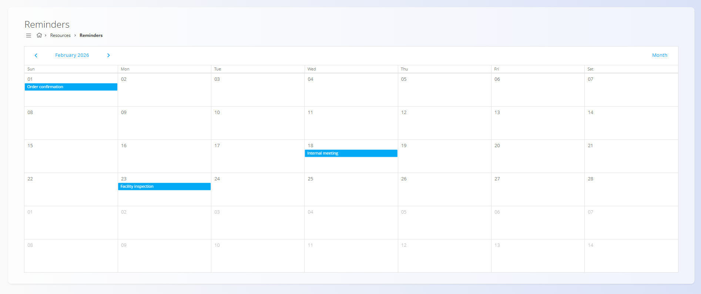
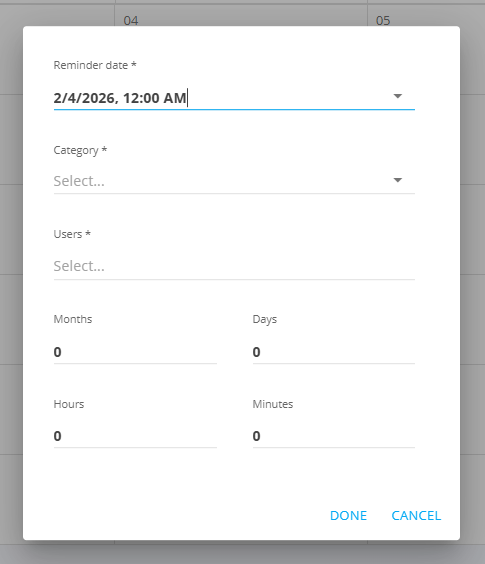

# Opomniki

Pogled **Opomniki** omogoča koledarski pregled načrtovanih opomnikov ter ustvarjanje obvestil za pomembne dogodke, roke in nadaljnja opravila.

Za dostop do **Opomnikov** pojdite na **Viri / Opomniki** v [navigaciji](../../Skupno/UI/Navigacija.md).

## Shema

Pri ustvarjanju ali urejanju opomnika se uporabljajo naslednja polja:

| Polje | Opis |
|------|------|
| **Datum opomnika** | Ciljni datum in čas, na katerega se opomnik nanaša (na primer rok, datum poteka ali načrtovan dogodek). |
| **Kategorija** | Razvrstitev opomnika, izbrana iz vnaprej definiranih [kategorij opomnikov](../Upravljanje/KategorijeOpomnikov.md). |
| **Uporabniki** | Uporabniki, ki bodo prejeli obvestilo opomnika. |
| **Zamik opomnika (Meseci, Dnevi, Ure, Minute)** | Časovni zamik, ki določa, **koliko časa pred datumom opomnika** se sproži obvestilo. |

## Koledarski pogled opomnikov

Opomniki so prikazani v **mesečnem koledarskem pogledu**.

- vsak opomnik je prikazan na svojem načrtovanem datumu,
- na isti dan je lahko več opomnikov,
- uporabniki lahko preklapljajo med meseci.

### Predogled ob prehodu z miško

Premik kazalca nad opomnik prikaže informativni namig z:

- nazivom opomnika,
- datumom in časom opomnika,
- nastavitvijo zamika.

### Urejanje opomnikov

Z **dvojnim klikom** na opomnik se ta odpre v načinu urejanja. Spremeniti je mogoče datum, kategorijo, uporabnike in zamik opomnika.

## Ustvarjanje novega opomnika

Nov opomnik se ustvari prek pogovornega okna za opomnike.

Pogovorno okno omogoča nastavitev datuma opomnika, kategorije, uporabnikov in zamika.

## Uporaba zamika opomnika

Zamik opomnika določa, **kdaj se obvestilo sproži glede na datum opomnika**.

Zamik se izračuna **nazaj** od datuma opomnika.

Primeri:

- **Meseci: 0, Dnevi: 0, Ure: 0, Minute: 0**  
  → opomnik se sproži **točno ob datumu in času opomnika**.

- **Dnevi: 1**  
  → opomnik se sproži **en dan pred datumom opomnika**.

- **Ure: 2, Minute: 30**  
  → opomnik se sproži **2 uri in 30 minut pred datumom opomnika**.

- **Meseci: 1**  
  → opomnik se sproži **en mesec pred datumom opomnika**.

Ta mehanizem omogoča pravočasno obveščanje za opravila, kot so poteki ponudb, pregledi, sestanki ali nadaljnja dejanja.

---