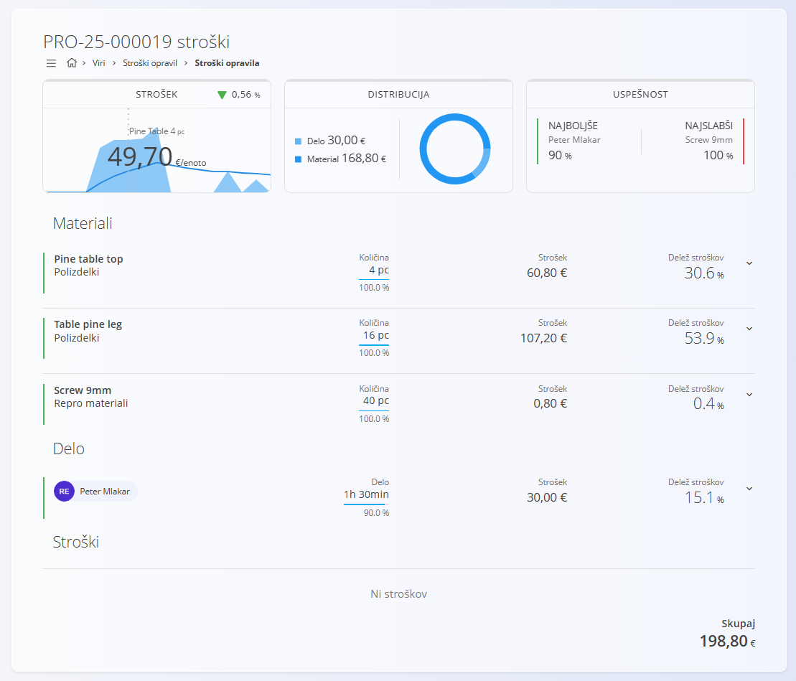

# Stroški opravil

Pogled **Stroški opravil** omogoča vpogled v **dejanske stroške izdelave posameznega opravila**, na podlagi porabljenih materialov, vloženega dela in dodatnih stroškov. Namenjen je predvsem analizi [proizvodnih nalogov](../../Proizvodnja/Dokumenti/ProizvodniNalogi.md) in [vzdrževalnih nalogov](../../Vzdrzevanje/Dokumenti/VzdrzevalniNalogi.md) ter razumevanju porazdelitve stroškov in uspešnosti.

Za dostop do **Stroškov opravil** pojdite na **Viri / Stroški opravil** v [navigaciji](../../Skupno/UI/Navigacija.md).

## Seznam stroškov opravil

Seznam prikazuje vsa opravila znotraj izbranega časovnega obdobja.

Vsaka vrstica predstavlja **eno opravilo**, običajno povezano s proizvodnim ali vzdrževalnim nalogom, in prikazuje:

- referenco opravila,
- datum nastanka,
- **strošek na enoto**,
- vizualne indikatorje spremembe stroška glede na prejšnje obdobje.

Filtri omogočajo omejevanje rezultatov glede na:

- **datum**,
- **pogled** (proizvodni nalogi / vzdrževalni nalogi).

Klik na opravilo odpre podroben pregled stroškov.

## Podrobnosti stroškov opravila

Izbira opravila odpre podroben pogled z natančno analizo stroškov.

### Pregled stroškov

Na vrhu zaslona so prikazani ključni kazalniki:

- **Strošek na enoto**,
- **trend stroška** v primerjavi s preteklimi vrednostmi,
- **distribucija stroškov** (material / delo),
- **kazalniki uspešnosti**, kot sta:
  - **Najboljše**,
  - **Najslabši** prispevek.

### Materiali

Razdelek **Materiali** prikazuje vse materiale, uporabljene pri izdelavi opravila:

- naziv materiala in tip,
- porabljena količina,
- strošek,
- **delež stroškov** v odstotkih.

Razširitev vrstice materiala prikaže dodatne podrobnosti, kjer so na voljo.

### Delo

Razdelek **Delo** prikazuje vložen čas zaposlenih v opravilo:

- zaposleni,
- trajanje dela,
- izračunan strošek dela,
- **delež stroškov**.

Stroški dela se izračunajo na podlagi nastavitev **Postavk virov**.

### Stroški

V tem razdelku so prikazani vsi dodatni stroški, povezani z opravilom (na primer namestitev, prevoz, storitve).  
Če stroški niso zabeleženi, je razdelek prikazan kot prazen z obvestilom *Ni stroškov*.

### Skupaj

Na dnu pogleda je prikazan **skupni strošek opravila**, ki vključuje:

- materiale,
- delo,
- dodatne stroške.

Ta vrednost predstavlja končni strošek izdelave ene enote.

## Opombe o uporabi

- Stroški opravil so **samo za branje** in jih sistem izračuna samodejno.
- Natančnost podatkov je odvisna od pravilne konfiguracije:
  - postavk virov,
  - cen materialov,
  - beleženja dela.
- Ta pogled najpogosteje uporabljajo vodje proizvodnje in analitiki.

---

