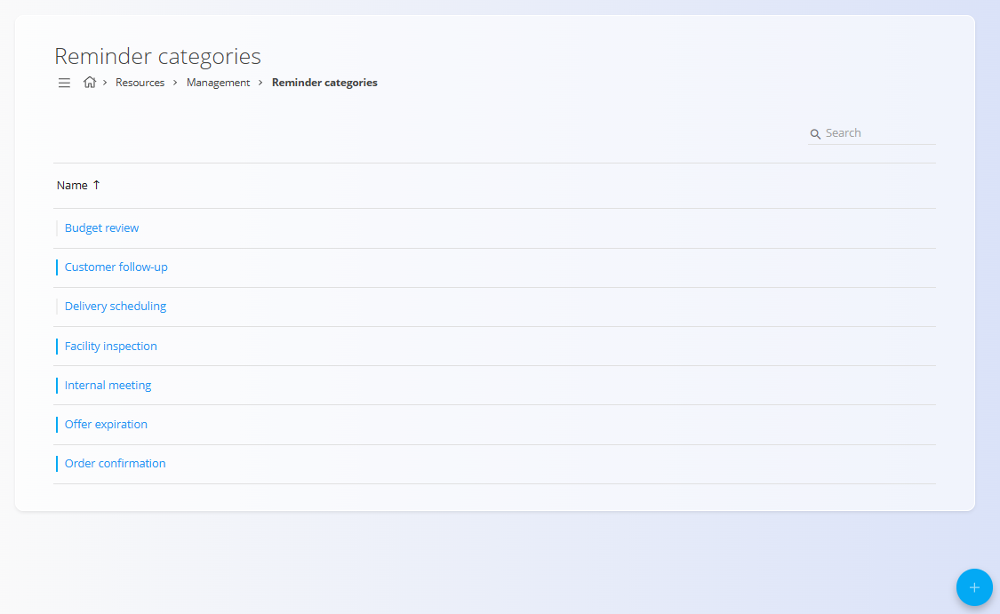
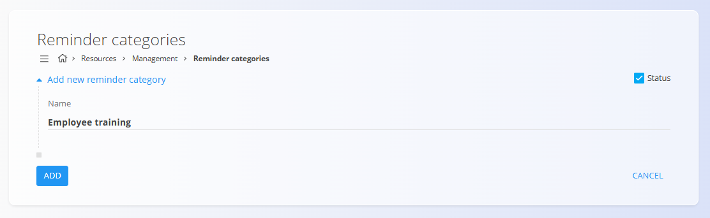

# Kategorije opomnikov

Kategorije opomnikov določajo **klasifikacijske oznake**, ki jih je mogoče dodeliti opomnikom v modulu [**Opomniki**](../Pregledi/Opomniki.md). Pomagajo organizirati opomnike glede na namen (na primer *Pregled proračuna* ali *Inšpekcija objekta*) in se ponovno uporabljajo v celotnem sistemu, kjer koli se opomniki ustvarjajo.

Za dostop do **Kategorij opomnikov** pojdite na **Viri / Upravljanje / Kategorije opomnikov** v [**navigaciji**](../../Skupno/UI/Navigacija.md).

## Shema

| Polje | Opis |
|------|------|
| **Naziv** | Naziv kategorije opomnika, ki je prikazan pri izbiri kategorije med ustvarjanjem ali urejanjem opomnika. |
| **Status** | Določa, ali je kategorija aktivna in na voljo za izbiro. Onemogočene kategorije ni mogoče uporabiti za nove opomnike. |

## Seznamski pogled

Seznamski pogled kategorij opomnikov prikazuje vse definirane kategorije.

Vsaka vrstica predstavlja eno kategorijo opomnika. Klik na kategorijo jo odpre za urejanje.

Aktivne kategorije so označene z modro ikono stanja, neaktivne pa s sivo ikono.

## Ustvarjanje kategorije opomnika

Za ustvarjanje nove kategorije opomnika:

1. Kliknite [**akcijski gumb**](../../Skupno/UI/AkcijskiGumb.md).
2. Vnesite ustrezen **Naziv** kategorije opomnika.
3. Preverite, ali je **Stanje** omogočeno, če naj bo kategorija na voljo.
4. Kliknite **Dodaj** za shranjevanje.

## Urejanje kategorije opomnika

Za urejanje obstoječe kategorije opomnika:

1. Kliknite kategorijo, ki jo želite urediti.
2. Po potrebi spremenite **Naziv** ali **Status**.
3. Kliknite **Shrani** za uveljavitev sprememb.

## Brisanje

Za brisanje kategorije opomnika:

1. Kliknite kategorijo, ki jo želite izbrisati.
2. Kliknite **Izbriši**.
3. Potrdite brisanje.

---
