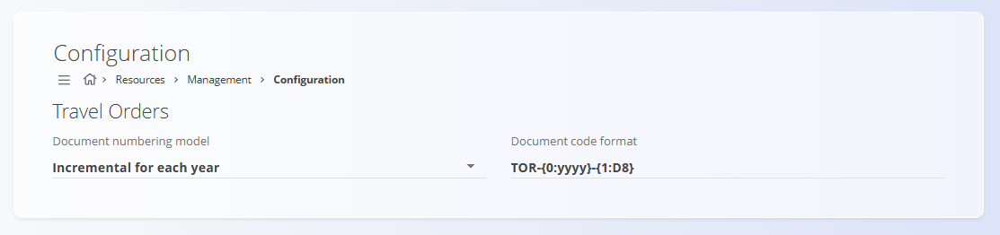

# Konfiguracija virov

Konfigurirajte nastavitve domene **Viri**, ki vplivajo na številčenje dokumentov in vedenje dokumentov, povezanih z viri. Vse spremembe se shranjujejo samodejno.

Za dostop do konfiguracije pojdite na **Viri / Upravljanje / Konfiguracija** v [navigaciji](../../Skupno/UI/Navigacija.md).

## Potni nalogi

Nastavite vedenje številčenja za dokumente **Potni nalogi**.

| Polje | Opis |
|------|------|
| **Model številčenja dokumentov** | Določa način generiranja številk dokumentov.   • **Povečevanje vsako leto:** številčenje se vsako koledarsko leto začne znova.   • **Povečevanje:** številčenje se nadaljuje brez ponastavitve. |
| **Format kode dokumenta** | Določa strukturo generirane kode dokumenta.   Nadomestni znaki, kot sta **{0:yyyy}** in **{1:D8}**, se samodejno zamenjajo ob ustvarjanju dokumenta. |

> [!TIP]
>
> Uporabljajte dosleden format kode dokumenta, da bodo potni nalogi lažje prepoznavni in razvrščeni skozi leta.

---