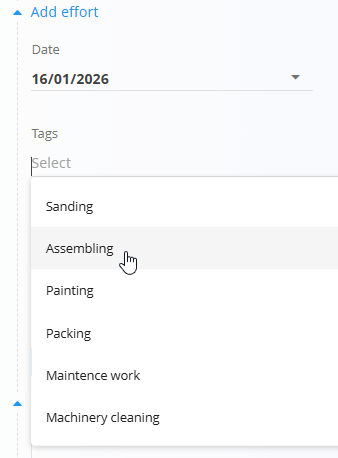

# Tipi dela

Tipi dela določajo **kategorije dela**, ki jih je mogoče izbrati pri beleženju napora na opravilih, proizvodnih izvedbah ali vzdrževalnih aktivnostih. Pomagajo standardizirati poročanje časa in izboljšujejo kasnejšo analizo porabe časa.

Za dostop do **Tipov dela** pojdite na **Viri / Upravljanje / Tipi dela** v [navigaciji](../../Skupno/UI/Navigacija.md).

## Shema

| Polje | Opis |
|------|------|
| **Naziv tipa dela** | Naziv tipa dela, kot je prikazan uporabnikom pri beleženju napora (na primer: *Sestavljanje*, *Barvanje*, *Vzdrževalna dela*). |
| **Uredi tip dela** | Neobvezen opis, ki pojasnjuje, kaj tip dela predstavlja. Namenjen je predvsem notranji razjasnitvi in administraciji. |
| **Omogočeno** | Določa, ali je tip dela aktiven in na voljo za izbiro v obrazcih za beleženje napora. |

## Seznamski pogled

Seznamski pogled prikazuje vse definirane tipe dela v sistemu.

- Omogočeni tipi dela so na voljo za izbiro pri beleženju napora.
- Onemogočeni tipi dela ostanejo shranjeni, vendar jih ni mogoče izbrati.
- Klik na tip dela ga odpre v načinu urejanja.

## Ustvarjanje in urejanje tipov dela

Kliknite [**akcijski gumb**](../../Skupno/UI/AkcijskiGumb.md), da ustvarite nov vnos, ali kliknite element na seznamu za urejanje obstoječega.

Pri ustvarjanju ali urejanju tipa dela lahko:

- nastavite **Naziv tipa dela**, ki je prikazan uporabnikom,
- dodate neobvezen **Uredi tip dela**,
- omogočite ali onemogočite tip dela.

## Uporaba pri beleženju napora

Tipi dela se uporabljajo, ko uporabniki beležijo napor na opravilih in izvedbah.

Pri dodajanju napora uporabniki izberejo tip dela iz spustnega seznama, ki je napolnjen iz te konfiguracije.

To zagotavlja, da je zabeležen čas dosledno kategoriziran v celotnem sistemu ter podpira natančno poročanje in analizo.

## Brisanje

Tipe dela je mogoče izbrisati v pogledu za urejanje.

> [!NOTE]
> Izbrisani tipi dela niso več na voljo za nove vnose časa, vendar ne vplivajo na zgodovinske podatke.

---