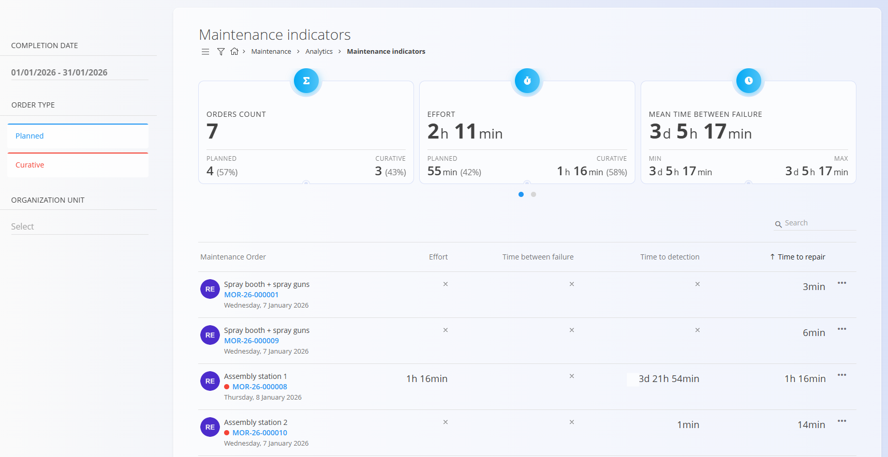

# Kazalniki vzdrževanja

Zaslon **Kazalniki vzdrževanja** omogoča analitični pregled uspešnosti vzdrževanja.
Združuje podatke iz **zaključenih [vzdrževalnih nalogov](../Dokumenti/VzdrzevalniNalogi.md)**
in pomaga oceniti učinkovitost, odzivnost ter zanesljivost vzdrževalnih aktivnosti.

Do tega zaslona dostopate prek **Vzdrževanje / Analiza / Kazalniki vzdrževanja**
v [**navigaciji**](../../Skupno/UI/Navigacija.md).

> [!NOTE]
> - Pri izračunu kazalnikov se upoštevajo samo **zaključeni** vzdrževalni nalogi
> - Rezultati so močno odvisni od:
>   - natančnega beleženja napora
>   - pravočasnega prijavljanja napak
>   - pravilnega zaključevanja nalogov

## Namen kazalnikov vzdrževanja

Kazalniki vzdrževanja omogočajo:

- spremljanje obsega in napora vzdrževanja
- primerjavo **preventivnega** in **kurativnega** vzdrževanja
- analizo odzivnih in popravilnih časov
- prepoznavanje zapoznelih, neučinkovitih ali ponavljajočih se napak
- podporo odločanju pri izboljšavah preventivnega vzdrževanja

Vsi kazalniki se izračunajo na podlagi izbranih **filtrov**.

## Filtri

Levi panel omogoča natančnejšo izbiro podatkov, prikazanih na zaslonu.

Na voljo so naslednji filtri:

- **Datum zaključitve** – Časovno obdobje za izračun kazalnikov
- **Tip naloga**
  - **Preventiva**
  - **Kurativa**
- **Organizacijska enota**

Vsaka sprememba filtra takoj ponovno izračuna kazalnike in posodobi seznam spodaj.

## Kartice kazalnikov

Na vrhu zaslona so prikazane kartice s povzetki ključnih kazalnikov.

### Število nalogov

Prikazuje skupno število zaključenih vzdrževalnih nalogov v izbranem obdobju.

- Razdeljeno na **Preventivo** in **Kurativo**
- Prikazana je tudi odstotna porazdelitev

Ta kazalnik pomaga razumeti obseg vzdrževanja in razmerje med preventivnimi
in korektivnimi posegi.

### Delo

Prikazuje skupni zabeleženi napor, porabljen za vzdrževalne naloge.

- Razdeljeno na **Preventivo** in **Kurativo**
- Temelji na naporu, zabeleženem med izvajanjem operacij

Omogoča vpogled v porazdelitev časa in obremenitve vzdrževanja.

### Povprečni čas med napakami

Prikazuje povprečni čas med napakami.

- Izračunan na podlagi kurativnih vzdrževalnih nalogov
- Prikazane so **najmanjše** in **največje** vrednosti

Ta kazalnik se pogosto uporablja za oceno zanesljivosti opreme.

---

### Povprečni čas za zaznavo napake

Povprečni čas med nastankom napake in njeno zaznavo.

- Uporaben za ocenjevanje učinkovitosti nadzora in poročanja

### Povprečni čas za odpravo napake

Povprečni čas, potreben za izvedbo vzdrževanja po začetku dela.

- Odraža učinkovitost izvajanja vzdrževanja

### Povprečni čas do nove napake

Povprečni čas delovanja pred nastankom nove napake.

- Pogosto se uporablja skupaj s kazalnikom časa med napakami
  za analizo zanesljivosti

## Seznam vzdrževalnih nalogov

Pod karticami kazalnikov je prikazan podroben seznam vzdrževalnih nalogov.

Vsaka vrstica predstavlja vzdrževalni nalog, vključen v izračun.

Prikazani podatki vključujejo:

- **Oprema**
- **Koda vzdrževalnega naloga**
- **Delo**
- **Čas med napakami**
- **Čas za zaznavo napake**
- **Čas za odpravo napake**

Ta seznam omogoča:

- podrobnejši pregled posameznih nalogov
- prepoznavanje odstopanj (zelo dolgi ali zelo kratki časi)
- povezovanje posameznih nalogov s skupnimi kazalniki

S klikom na vzdrževalni nalog se odpre njegov podrobni pogled.

## Razlikovanje med preventivo in kurativo

Vizualni označevalniki v seznamu omogočajo hitro razlikovanje tipov nalogov:

- **Kurativni vzdrževalni nalogi** so jasno označeni
- Preventivni nalogi so prikazani brez kurativnih oznak

To omogoča enostavno analizo vpliva korektivnega vzdrževanja
na skupne kazalnike uspešnosti.

---
