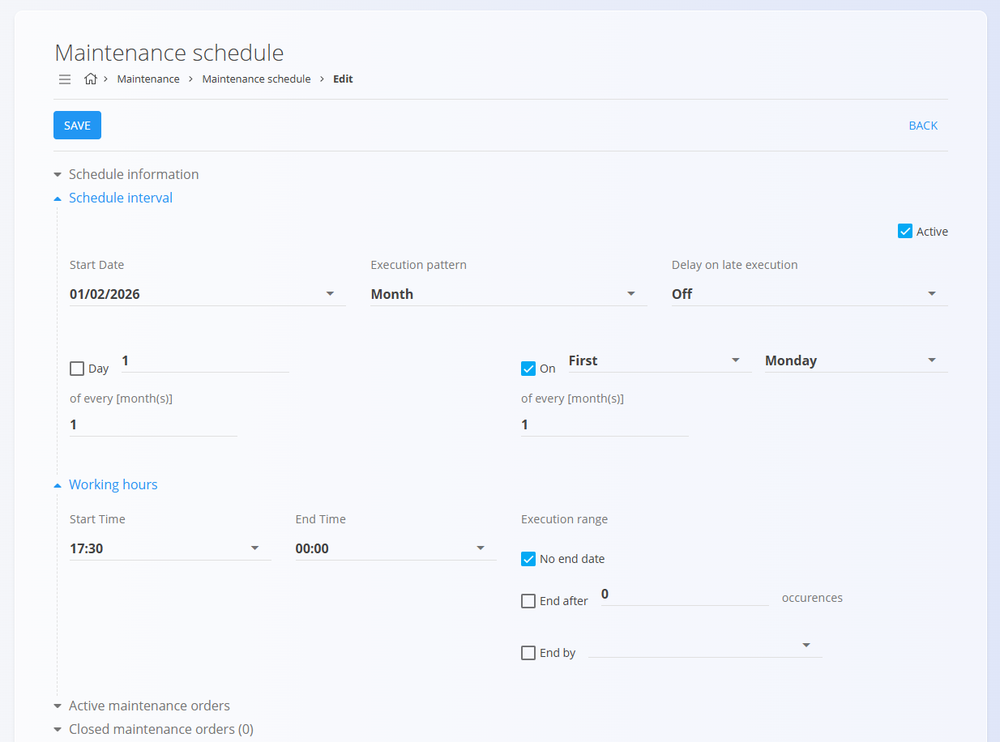

# Urniki vzdrževanja

**Urniki vzdrževanja** določajo, kako se **planirani vzdrževalni nalogi**
samodejno ustvarjajo skozi čas ali glede na uporabo, na podlagi
definiranega **vzorca izvedbe**.

Urniki vzdrževanja se ustvarijo kot del planiranega vzdrževanja in
zagotavljajo, da se preventivno vzdrževanje izvaja redno, brez ročnega
ustvarjanja nalogov.

Za dostop do urnikov vzdrževanja pojdite na **Vzdrževanje / Urniki vzdrževanja**
v [navigaciji](../../Skupno/UI/Navigacija.md).

## Seznam urnikov vzdrževanja

Stran **Urniki vzdrževanja** prikazuje vse obstoječe urnike, ustvarjene iz
planiranih vzdrževalnih nalogov.

Vsak zapis predstavlja **ponavljajočo definicijo vzdrževanja**, ki je
povezana z:
- določeno opremo
- vzdrževalnim procesom in verzijo
- ponavljajočim vzorcem izvedbe (časovni ali števec/uporaba)

Klik na [**akcijski gumb**](../../Skupno/UI/AkcijskiGumb.md) ustvari
[**nov vzdrževalni nalog**](VzdrzevalniNalogi.md).

Nato lahko določite podrobnosti naloga in izberete, ali se bo vzdrževanje
izvedlo **enkratno** ali pa bo ustvarjen **ponavljajoč urnik vzdrževanja**.

### Prikazane informacije v seznamu

Za vsak urnik seznam prikazuje:
- **Oprema**
- **Urnik** (povezava za urejanje urnika)
- **Naslednji datum izvedbe** (za časovne urnike) ali
  **Naslednji prag izvedbe** (za urnike na podlagi števcev)
- **Vzorec izvedbe**
- **Proces in verzija**

Klik na **Urnik** odpre zaslon za urejanje urnika.

### Razpoložljivi filtri

Za zoženje seznama uporabite filtre na levi strani:

- **Planiran začetek** – filtriranje urnikov po datumskem razponu
- **Ekipe** – filtriranje po dodeljenih ekipah

Iskalno polje omogoča filtriranje po nazivu opreme ali procesu.

## Kako se ustvarijo urniki vzdrževanja

Urniki vzdrževanja se ustvarijo **samodejno**, ko je planirani
vzdrževalni nalog konfiguriran s **ponavljajočim vzorcem izvedbe**.

Podprti vzorci ponavljanja vključujejo:
- **Časovne vzorce** (npr. mesečno, letno, vsakih X dni)
- **Vzorce na podlagi števcev/uporabe**
  (npr. vsakih X kosov, metrov, gramov, ur),
  z uporabo ustreznih števcev opreme in merskih enot

> [!NOTE]
> Za konfiguracijo števcev uporabe na virih in opremi glejte **[Stanja števcev](StanjaStevcev.md)**.

Ko je urnik ustvarjen, je odgovoren za generiranje prihodnjih
vzdrževalnih nalogov v skladu z določenim intervalom ali pragom uporabe,
kar omogoča neprekinjeno preventivno vzdrževanje brez ročnega dela.

## Urejanje urnika vzdrževanja

Za urejanje urnika vzdrževanja kliknite **Urnik** pri posameznem zapisu
v seznamu urnikov vzdrževanja.

Odpre se zaslon **Uredi urnik vzdrževanja**, kjer lahko prilagodite,
kako in kdaj se ustvarjajo vzdrževalni nalogi.

### Interval urnika

Razdelek **Interval urnika** določa logiko ponavljanja urnika vzdrževanja.

Tukaj lahko nastavite:
- **datum začetka** urnika
- **vzorec izvedbe** (npr. mesečno, letno, intervalno ali na podlagi števcev)
- ali je urnik **aktiven**

Razpoložljiva polja in možnosti se dinamično spreminjajo glede na izbrani
vzorec izvedbe.

### Delovni čas

Razdelek **Delovni čas** določa časovno okno, v katerem so ustvarjeni
vzdrževalni nalogi planirani za začetek in zaključek.

To omogoča uskladitev vzdrževalnih aktivnosti z operativnimi ali
izmensko-organizacijskimi omejitvami.

### Obseg izvajanja

Razdelek **Obseg izvajanja** določa, kako dolgo je urnik veljaven, na primer:
- izvajanje brez omejitve
- zaključek po določenem številu izvedb
- zaključek na določen datum

### Povezani vzdrževalni nalogi

Na dnu zaslona urnik prikazuje:
- **Aktivne vzdrževalne naloge**, ustvarjene iz tega urnika
- **Zaprte vzdrževalne naloge**, ki predstavljajo zaključene izvedbe

To omogoča sledljivost med urnikom in vsemi vzdrževalnimi nalogi, ki so
bili ustvarjeni na njegovi osnovi.

Kliknite **Shrani**, da uveljavite spremembe urnika.

> [!NOTE]
> Spremembe urnika vzdrževanja vplivajo **samo na prihodnje vzdrževalne naloge**.  
> Že ustvarjeni vzdrževalni nalogi se ne spreminjajo.

## Povezava z vzdrževalnimi nalogi

Urniki vzdrževanja delujejo v tesni povezavi z vzdrževalnimi nalogi:

- vsak urnik samodejno generira **vzdrževalne naloge v obdelavi**
- ustvarjeni nalogi so vidni v:
  - [**Vzdrževalni nalogi**](VzdrzevalniNalogi.md)
  - [**Koledar vzdrževanja**](KoledarVzdrzevanja.md)
- po zaključku vzdrževalnega naloga urnik nadaljuje z generiranjem
  naslednje izvedbe v skladu s svojo konfiguracijo

To zagotavlja, da je preventivno vzdrževanje neprekinjeno in ne temelji
na ročnem ustvarjanju nalog—ne glede na to, ali je osnovano na času ali
na uporabi.

---
