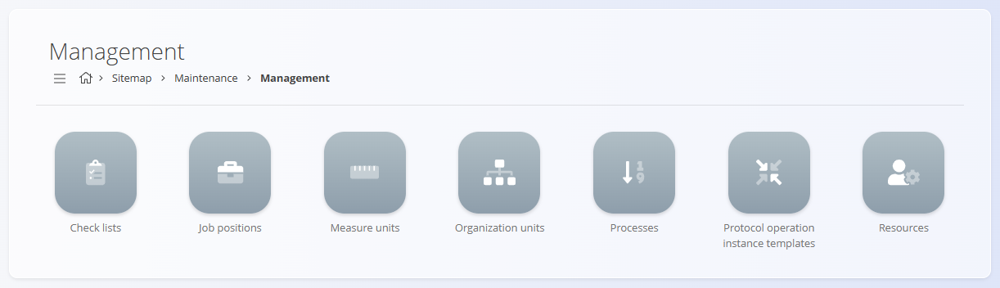
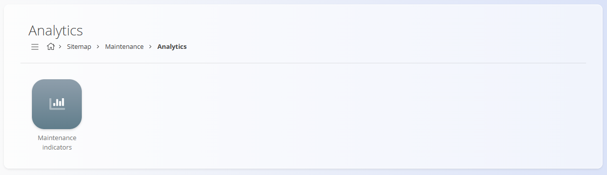

# Vzdrževanje

Domena **Vzdrževanje** zagotavlja namenski delovni prostor za planiranje,
izvajanje in analizo vzdrževanja opreme. Združuje način definiranja
vzdrževalnih procesov, ustvarjanje in izvajanje nalogov ter merjenje
uspešnosti za stalno izboljševanje.

To domeno uporabljate za:
- planiranje preventivnega vzdrževanja in urnikov ponavljajočih se del
- izvajanje kurativnega vzdrževanja na podlagi prijavljenih napak
- spremljanje operacij, virov, vhodov in kontrolnih seznamov med vzdrževanjem
- pregled kazalnikov za oceno zanesljivosti in odzivnosti

Do domene Vzdrževanje dostopate prek **Vzdrževanje** v
[**navigaciji**](../../Skupno/UI/Navigacija.md).

> [!NOTE]
> Razpoložljive domene so odvisne od konfiguracije in poslovnega modela
> posameznega podjetja.

## Kaj vključuje domena Vzdrževanje?

Domena je strukturirana v funkcionalna področja za dnevno delo in analizo:

- **Dokumenti** – ustvarjanje in upravljanje vzdrževalnih aktivnosti ter njihovega življenjskega cikla
  - **[Vzdrževalni nalogi](../Dokumenti/VzdrzevalniNalogi.md)** — definiranje in izvajanje planiranega ali kurativnega vzdrževanja na podlagi izbranega vzdrževalnega procesa in verzije. Podpira operacije, vire, vhode in preverjanja kakovosti.
  - **[Urniki vzdrževanja](../Dokumenti/UrnikiVzdrzevanja.md)** — konfiguracija ponavljajočih se vzorcev izvajanja (časovno ali na podlagi števcev), ki samodejno ustvarjajo vzdrževalne naloge.
  - **[Prijavljene napake](../Dokumenti/PrijavljeneNapake.md)** — zajem težav z opremo na terenu; iz prijavljenih napak se ustvarijo kurativni vzdrževalni nalogi.
  - **[Koledar vzdrževanja](../Dokumenti/KoledarVzdrzevanja.md)** — koledarski pogled planiranega in aktivnega vzdrževanja z možnostjo filtriranja po organizacijski enoti, virih in statusu naloga.
  - **[Stanja števcev](../Dokumenti/StanjaStevcev.md)** — konfiguracija delovnih časovnih oken in števcev uporabe (npr. kosi, metri, grami, ure), ki se uporabljajo v urnikih in vzdrževanju na podlagi števcev.

## Upravljanje

Konfiguracija skupnih struktur, ki se uporabljajo pri vzdrževanju.
Domena Vzdrževanje uporablja skupne šifrante, ki so deljeni s
[**Proizvodnjo**](../../Proizvodnja/Domena/Proizvodnja.md).

- **[Procesi](../../Proizvodnja/Upravljanje/Procesi.md)** — definicija korakov procesov in verzij, ki se uporabljajo za izvajanje vzdrževalnih operacij.
- **[Organizacijske enote](../../Proizvodnja/Upravljanje/OrganizacijskeEnote.md)** — definicija operativnih enot (npr. vzdrževalni oddelki, servisne ekipe).
- **[Viri](../../Proizvodnja/Upravljanje/Viri.md)** — upravljanje človeških in nečloveških virov (tehniki, orodja, oprema).
- **[Kontrolni seznami](../../Proizvodnja/Upravljanje/KontrolneListe.md)** — ustvarjanje in kategorizacija kontrolnih seznamov, ki se uporabljajo med vzdrževalnimi operacijami.

Ti šifranti omogočajo vodenje vzdrževalnih tokov dela in izvajanja prek nalogov in urnikov.

> [!TIP]
Oglejte si celoten seznam upravljanja: **[Kazalo upravljanja](../../KazaloUpravljanja.md)**.

## Analitika

Spremljanje uspešnosti in zanesljivosti s pomočjo vgrajene analitike.

- **[Kazalniki vzdrževanja](../Analiza/KazalnikiVzdrzevanja.md)** — kartice KPI in podrobni seznami za MTBF, čas zaznave napake, čas odprave napake, napor in razčlenitev obremenitev.

## Življenjski cikel in izvajanje

- Potek statusov: **V obdelavi → Aktiven → Zaprt**
- Izvajanje: izvajalci izvajajo operacije glede na izbrani proces.
- Sledljivost: beležijo se napor, vhodi, nečloveški viri in kontrolni seznami.
- Sprožilci: prijavljene napake sprožijo kurativno delo; urniki samodejno ustvarjajo planirane naloge.

> [!NOTE]
> Podrobna poglavja za vsako stran (nalogi, urniki, napake, koledar, kazalniki)
> so na voljo in vsebujejo navodila po korakih. Ta stran služi kot pregled domene.

---
