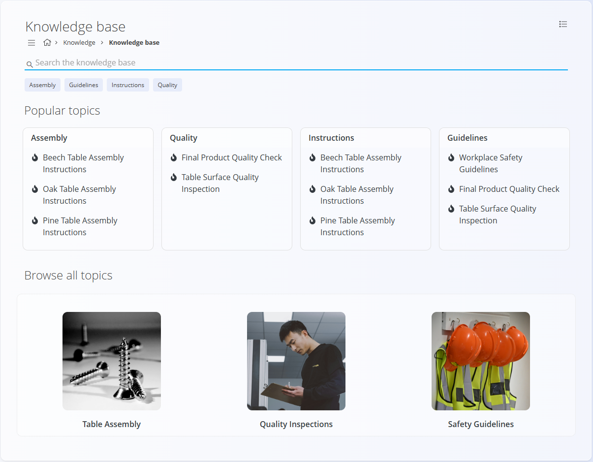
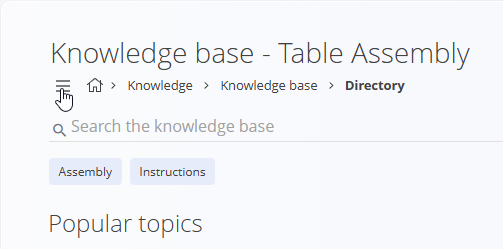
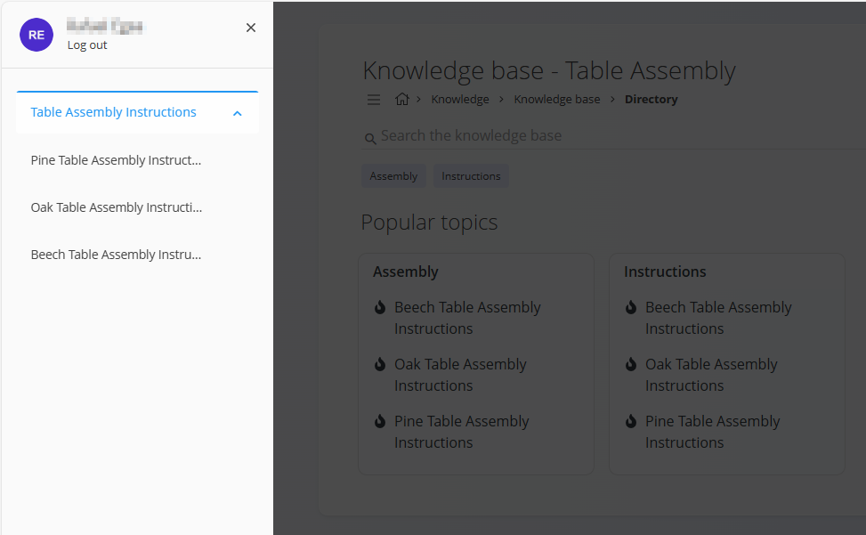
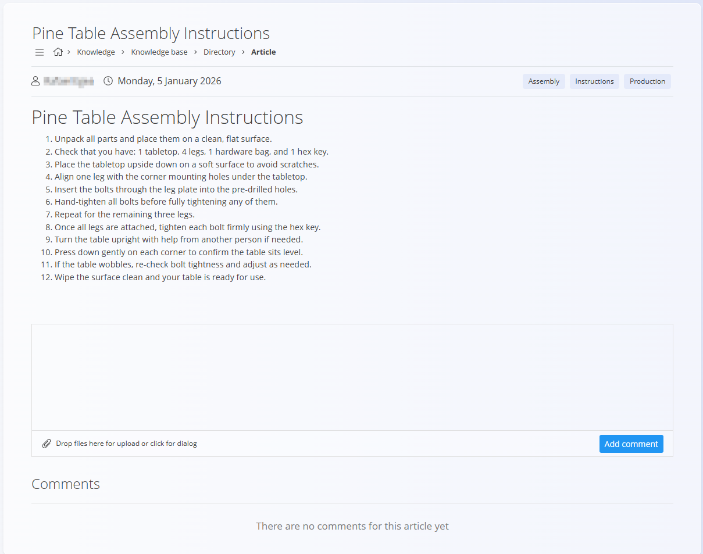

# Baza znanja

**Baza znanja** je glavni zaslon, kjer je predstavljena vsa **objavljena vsebina znanja**. Uporabnikom nudi osrednje mesto za brskanje, iskanje in branje interne dokumentacije, kot so navodila, smernice, postopki in referenčni članki.

**Baza znanja** se uporablja predvsem kot **interna knjižnica dokumentacije** in podpira vsakodnevno operativno delo v več domenah.

Za dostop do tega zaslona pojdite na **Znanje / Baza znanja** v [**navigaciji**](../../Skupno/UI/Navigacija.md).

## Pregled

Začetna stran **Baze znanja** je zasnovana tako, da uporabnikom omogoča hitro iskanje relevantne vsebine. Združuje **iskanje**, **filtriranje po oznakah** in **vizualno navigacijo**, s katerimi izpostavi pogosto uporabljene ali pomembne članke.

Zaslon je samo za branje, razen **komentarjev** pri člankih, kjer je komentiranje omogočeno.

## Iskanje in filtriranje

Na vrhu strani je **iskalna vrstica**, ki omogoča iskanje po **Bazi znanja** glede na:

- naslov članka
- vsebino članka
- oznake

Pod iskalno vrstico so prikazane **oznake**, ki jih je mogoče uporabiti kot hitre filtre. Klik na oznako filtrira vidno vsebino na članke, povezane z izbrano oznako.

Oznake so definirane v **[Oznake imenika](../Upravljanje/OznakeImenika.md)**.

## Priljubljene teme

Razdelek **Priljubljene teme** združuje pogosto uporabljene ali izpostavljene članke glede na oznake.

Vsaka kartica predstavlja oznako (npr. *Montaža*, *Kakovost*, *Navodila*) in vsebuje seznam povezanih člankov. Klik na članek ga odpre neposredno.

Ta razdelek uporabnikom omogoča hiter dostop do pogosto uporabljenih navodil in smernic brez potrebe po brskanju po celotni strukturi imenikov.

## Brskanje po vseh temah

Razdelek **Brskanje po vseh temah** ponuja vizualni pregled vsebine v Bazi znanja, običajno predstavljen z imeniki ali urejenimi temami.

Vsaka ploščica vodi do skupine povezanih člankov in omogoča raziskovanje **Baze znanja** po temah, namesto po oznakah ali iskanju.

To je še posebej uporabno za uvajanje novih uporabnikov, usposabljanje in splošno raziskovanje razpoložljive dokumentacije.

Klik na ploščico imenika odpre **pogled imenika**, kjer lahko uporabniki navigirajo med članki in odprejo kazalo vsebine.

## Pogled imenika

Klik na imenik v razdelku **Prebrskaj vse teme** odpre **pogled imenika**, ki prikazuje članke znotraj izbranega imenika.

Pogled imenika vključuje:

- **iskalno vrstico** – iskanje znotraj Baze znanja
- **oznake** – filtriranje vsebine po oznakah
- **priljubljene teme** – hiter dostop do člankov, združenih po oznakah

V pogledu imenika meni omogoča:
- urejanje oznak in
- urejanje imenika.

### Kazalo

Za pregled vseh člankov v imeniku odprite **kazalo** z uporabo **ikone menija** v zgornjem levem kotu.

Kazalo prikazuje strukturo imenika in razpoložljive članke. Klik na članek ga odpre v [pogledu članka](#pogled-članka).

Struktura imenikov in kazala je nastavljena v **[Imeniki](../Upravljanje/Imeniki.md)** in **[Kazalo](../Upravljanje/Kazalo.md)**.

## Pogled članka

Klik na članek odpre **pogled članka**, kjer je prikazana celotna vsebina.

Pogled članka vključuje:

- **naslov članka**
- **avtorja**
- **datum objave**
- **oznake**, povezane s člankom
- **glavno vsebino** (oblikovano besedilo, sezname, navodila)
- **priloge** (če so vključene)
- **razdelek za komentarje** (če je omogočen)

### Komentarji

Če je komentiranje omogočeno, lahko uporabniki:

- dodajajo komentarje
- nalagajo datoteke kot del komentarja
- pregledujejo komentarje drugih uporabnikov

To omogoča sodelovanje, povratne informacije in pojasnila neposredno znotraj dokumentacije.

## Uporaba

**Baza znanja** se običajno uporablja za:

- branje delovnih navodil in postopkov
- dostop do internih smernic in politik
- podporo proizvodnji, logistiki, kakovosti in vzdrževanju
- uvajanje novih zaposlenih
- deljenje internega znanja in dobrih praks

> [!NOTE]
> - Baza znanja prikazuje samo **objavljeno** in **omogočeno** vsebino.  
> - Vidnost člankov je odvisna od stanja imenika in nastavitev objave.  
> - Komentarji in priloge so odvisni od konfiguracije posameznega članka.

## Povezano

- **[Imeniki](../Upravljanje/Imeniki.md)** – upravljanje vsebinskih vsebnikov in navigacije  
- **[Članki](../Upravljanje/Clanki.md)** – ustvarjanje in urejanje vsebine  
- **[Oznake imenika](../Upravljanje/OznakeImenika.md)** – definicija oznak za filtriranje  
- **[Kazalo](../Upravljanje/Kazalo.md)** – nastavitev navigacije znotraj imenikov  

---
