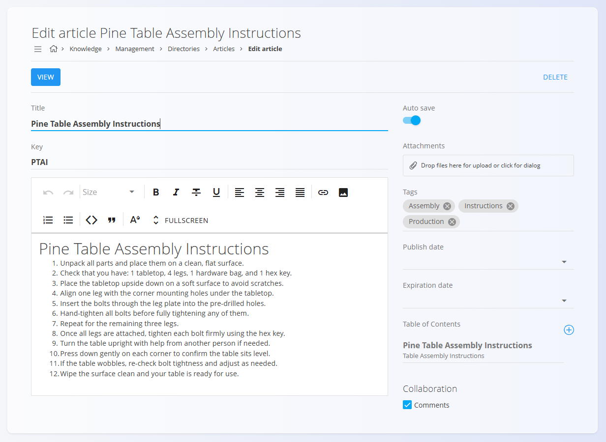
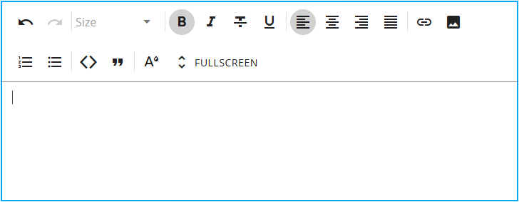

# Članki

**Članki** so glavne vsebinske enote [**baze znanja**](../BazaZnanja/BazaZnanja.md). Vsebujejo pisno dokumentacijo, kot so navodila, smernice, postopki in referenčne informacije.

Članki spadajo v imenik in jih je mogoče organizirati ter po njih krmariti z uporabo [**kazala**](Kazalo.md) imenika.

Za upravljanje člankov pojdite na **Znanje / Upravljanje / Imeniki** v [navigaciji](../../Skupno/UI/Navigacija.md) in kliknite **Članki** pod želenim imenikom. Glejte tudi [Imeniki](Imeniki.md).

## Shema

| Polje | Opis |
|------|------|
| **Naslov** | Prikazni naslov članka (obvezno). |
| **Ključ** | Kratek enolični identifikator članka (obvezno). |
| **Vsebina** | Glavno besedilo članka, urejeno z urejevalnikom besedila. |
| **Priponke** | Neobvezne datoteke, priložene članku. |
| **Oznake** | Oznake za kategorizacijo in filtriranje članka. |
| **Datum objave** | Datum, od katerega je članek viden. |
| **Datum veljavnosti** | Datum, po katerem članek ni več viden. |
| **Sodelovanje** | Omogoča ali onemogoča komentarje na članku. |
| **Samodejno shranjevanje** | Samodejno shranjuje spremembe med urejanjem. |

## Upravljanje

### Seznam člankov

Seznamski pogled prikazuje vse članke, ki pripadajo izbranemu imeniku.

Vsaka vrstica prikazuje:
- **Naslov članka**
- **Datum zadnje spremembe**

Članke lahko iščete z uporabo **iskalnega polja** v zgornjem desnem kotu.

Klik na članek ga odpre za urejanje.

## Dejanja

Kliknite **akcijski gumb**, da ustvarite nov članek.

### Dodaj nov članek

Pri ustvarjanju ali urejanju članka so na voljo polja, ki so opisana v razdelku [**Shema**](#shema) zgoraj.

Med urejanjem članka kliknite **Pogled** v zgornjem levem kotu za predogled, kako bo članek prikazan v [**bazi znanja**](../BazaZnanja/BazaZnanja.md).

Če je možnost **Samodejno shranjevanje** omogočena, se spremembe shranjujejo samodejno.

## Urejevalnik besedila

Vsebina članka se piše z vgrajenim **urejevalnikom besedila**.

Urejevalnik ponuja običajne možnosti oblikovanja, ki jih najdemo v večini urejevalnikov besedila, vključno z:

- oblikovanjem besedila (naslovi, krepko, ležeče, seznami)
- poravnavo besedila
- povezavami in slikami
- celozaslonskim urejanjem

Urejevalnik je zasnovan tako, da omogoča jasno in strukturirano dokumentacijo brez potrebe po tehničnem znanju.

## Priponke

Članki lahko vključujejo **datotečne priloge**, kot so dokumenti ali slike.

Priponke se naložijo prek **območja za nalaganje** na zaslonu za urejanje članka in so prikazane skupaj z vsebino v [**bazi znanja**](../BazaZnanja/BazaZnanja.md).

## Oznake

Oznake se uporabljajo za kategorizacijo člankov in lažje iskanje vsebine v sistemu.

Oznake se izberejo iz **[Oznake imenika](OznakeImenika.md)** in jih je mogoče ponovno uporabiti v več člankih.

## Objavljanje in veljavnost

Članke je mogoče časovno načrtovati z uporabo:

- **Datum objave** – določa, kdaj postane članek viden
- **Datum veljavnosti** – določa, kdaj članek ni več viden

Če datumi niso nastavljeni, je članek viden takoj in brez časovne omejitve.

## Sodelovanje

Ko je možnost **Sodelovanje** omogočena, lahko uporabniki dodajajo komentarje k članku.

To omogoča povratne informacije, pojasnila in razpravo neposredno na dokumentaciji.

## Brisanje

Kliknite **Izbriši** na zaslonu za urejanje članka, da odprete potrditveno pogovorno okno:

**Ali ste prepričani, da želite izbrisati ta zapis?**

Če potrdite, se članek trajno odstrani.

> [!NOTE]
> Brisanje članka ga odstrani tudi iz imenikovega kazala.

## Povezano

- **[Baza znanja](../BazaZnanja/BazaZnanja.md)** – brskanje in branje objavljenih člankov  
- **[Imeniki](Imeniki.md)** – upravljanje imenikov, ki združujejo članke  
- **[Kazalo](Kazalo.md)** – definiranje navigacije znotraj imenika  
- **[Oznake imenika](OznakeImenika.md)** – kategorizacija in filtriranje člankov  

---
