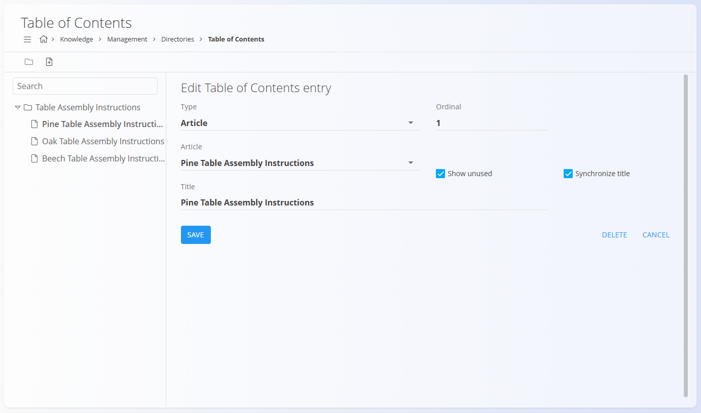

# Kazalo

**Kazalo** določa **navigacijsko strukturo** znotraj imenika v [**bazi znanja**](../BazaZnanja/BazaZnanja.md).  
Omogoča hierarhično razporeditev člankov ter uporabnikom nudi jasen pregled nad vsebino.

Imenik lahko vsebuje **eno ali več kazal**.

Za upravljanje kazala pojdite na **Znanje / Upravljanje / Imeniki**, nato kliknite **Kazalo** pod izbranim imenikom.

## Pregled

Kazalo je prikazano kot **drevesna struktura** in lahko vsebuje:

- **Mape**
- **Članke**
- **URL povezave**

Vnosi so razvrščeni po **ordinalni vrednosti** in jih je mogoče omogočiti ali onemogočiti.

> [!TIP]
> Razvrščanje poteka prek polja **Ordinal**.  
> Povleci-in-spusti ni podprt.

## Shema

| Polje | Opis |
|------|------|
| **Tip** | Vrsta vnosa: mapa, članek ali URL. |
| **Naslov** | Prikazni naslov vnosa kazala. |
| [**Članek**](Clanki.md) | Povezan članek (na voljo, če je tip *članek*). |
| **Povezava** | Prikazano besedilo URL povezave. |
| **Ordinal** | Položaj vnosa znotraj iste ravni. |
| **Omogočeno** | Določa vidnost vnosa v [**bazi znanja**](../BazaZnanja/BazaZnanja.md). |
| **Prikaži neuporabljene** | Prikaže članke, ki še niso uporabljeni v kazalu. |
| **Sinhroniziraj naslov** | Sinhronizira naslov z naslovom povezanega članka. |

(… nadaljuje se skladno z izvirnikom)

---
