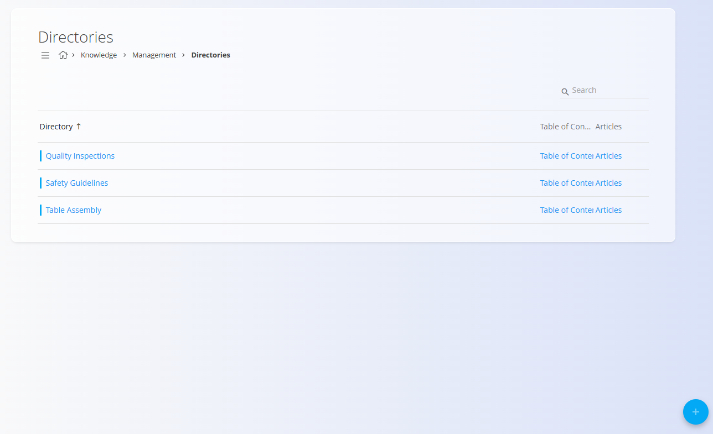

# Imeniki

Šifrant **Imeniki** določa glavne **vsebinske vsebnike**, uporabljene v **bazi znanja**.  
Vsak imenik predstavlja temo ali kategorijo (na primer *Montaža miz*, *Varnostna navodila*, *Pregledi kakovosti*) in vsebuje članke ter strukturo kazala vsebine.

Imeniki se uporabljajo za organizacijo vsebine in določajo, kako so članki združeni in kako se po njih navigira v [**bazi znanja**](../BazaZnanja/BazaZnanja.md).

Za dostop do tega zaslona pojdite na **Znanje / Upravljanje / Imeniki** v [**navigaciji**](../../Skupno/UI/Navigacija.md).

## Shema

| Polje | Opis |
|------|------|
| **Naziv** | Prikazno ime imenika (obvezno). |
| **Ključ** | Kratek enolični identifikator imenika (obvezno). |
| **Opis** | Neobvezen opis namena imenika. |
| **Slika** | Neobvezna slika za vizualno predstavitev imenika (priporočeno razmerje 1 : 1). |
| **Omogočen** | Določa, ali je imenik viden in na voljo v [**bazi znanja**](../BazaZnanja/BazaZnanja.md). |

## Upravljanje

### Seznam imenikov

Seznamski pogled prikazuje vse konfigurirane imenike.

Vsaka vrstica prikazuje:
- **Imenik** – ime imenika
- **Povezave** za upravljanje:
  - **[Kazalo](Kazalo.md)**
  - **[Članki](Clanki.md)**

Levo od imena imenika je prikazan indikator stanja:
- **Modra** – omogočen / aktiven imenik
- **Siva** – onemogočen / neaktiven imenik

Imenike lahko iščete z uporabo **iskalnega polja** v zgornjem desnem kotu.

Klik na ime imenika odpre zaslon za urejanje.

## Dejanja

Kliknite **akcijski gumb** za dodajanje novega imenika.

### Dodaj nov imenik

Izpolnite naslednja polja:

- **Ime**
- **Ključ**
- **Opis** (neobvezno)
- **Slika** (neobvezno)
- **Omogočen** – določa, ali je imenik viden v [**bazi znanja**](../BazaZnanja/BazaZnanja.md)

Kliknite **Dodaj**, da shranite nov imenik.

Po ustvarjanju postane imenik na voljo v [**bazi znanja**](../BazaZnanja/BazaZnanja.md) in ga je mogoče zapolniti z vsebino.

## Upravljanje vsebine imenika

Po ustvarjanju imenika so na voljo dodatne možnosti neposredno iz seznama:

- **[Članki](Clanki.md)** – upravljanje člankov v imeniku  
- **[Kazalo](Kazalo.md)** – določanje navigacijske strukture znotraj imenika  

> [!NOTE]
> Imeniki določajo **samo strukturo**.  
> Članki in kazala se upravljajo ločeno.

## Urejanje imenika

Kliknite ime imenika, da odprete zaslon za urejanje.

Na voljo so:
- sprememba imena, ključa ali opisa
- omogočanje ali onemogočanje imenika
- posodobitev slike imenika

Kliknite **Shrani**, da potrdite spremembe.

## Brisanje

Kliknite **Izbriši** na zaslonu za urejanje, da odprete potrditveno pogovorno okno:

**Ali ste prepričani, da želite izbrisati ta zapis?**

Če potrdite, se imenik trajno odstrani.

> [!NOTE]
> Imenik je mogoče izbrisati le, če ne vsebuje člankov ali vnosov kazala.

## Povezano

- **[Baza znanja](../BazaZnanja/BazaZnanja.md)**  
- **[Članki](Clanki.md)**  
- **[Kazalo](Kazalo.md)**  
- **[Oznake imenika](OznakeImenika.md)**

---
